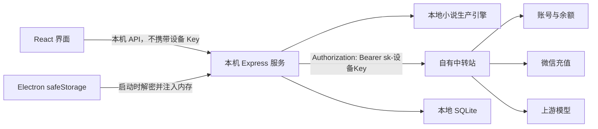

# 桌面端设备 Key、同步注册与充值闭环实施方案

> 状态：计划中，等待中转站契约确认后实施
> 创建日期：2026-07-28
> 适用产品：0xNovelAgent Windows 本地 EXE
> 关联总纲：[本地 EXE 创作平台 SaaS 重构总纲](./local-exe-saas-rebuild-plan.md)

## 1. 结论

设备 Key 是登录成功后，由中转站为当前电脑自动签发的一枚独立 API Key。它代表的是：

> “这个中转站账号授权这台 0xNovelAgent 设备调用 AI、查询余额、查询消费记录和发起充值。”

设备 Key 的核心作用有五个：

1. **让本机服务代表当前用户调用中转站 AI。**
2. **让中转站知道费用应从哪个用户余额中扣除。**
3. **让余额、消费日志和充值订单只能访问当前用户的数据。**
4. **让每台设备可以单独吊销，不影响账号密码和其他电脑。**
5. **避免把网页登录 Cookie、账号密码或管理员 Key 当作长期 AI 调用凭证。**

设备 Key 不应由用户手动复制、填写或维护。注册或登录成功后，客户端应自动完成签发、安全保存和注入本机服务。

## 2. 已确认产品决策

本方案按以下决策执行：

- 首次使用必须登录或注册，不提供未登录游客模式。
- 注册操作由 0xNovelAgent 调用中转站内部注册接口同步完成。
- 中转站是账号、余额、充值订单和消费记录的唯一数据源。
- 本地不建设第二套用户、钱包、订阅或支付数据库。
- 商业模式第一版只做“充值余额 + 按量扣费”。
- 第一版不做会员、月度订阅、自动续费、邀请返利和签到。
- 小说正文、角色、世界观、任务和版本仍保存在本地。
- 已经成功登录过的用户断网后可以打开和手动编辑本地作品，但不能调用 AI 或充值。

## 3. 概念边界

### 3.1 账号密码

用途：

- 注册中转站账号。
- 登录中转站。
- 重置密码。

安全要求：

- 不写入本地数据库。
- 不写入日志。
- 不保存为配置文件。
- 注册或登录请求结束后从应用状态中清除。

### 3.2 Session Cookie

用途：

- 证明用户已经登录中转站网页账户体系。
- 查询和更新用户资料。
- 创建、查看或吊销设备 Token。

它不适合作为本机 AI 长期调用凭证，原因包括：

- Cookie 生命周期与网页会话绑定。
- 容易受跨域、Cookie 策略和会话过期影响。
- 不利于区分多台设备。
- 无法单独吊销一台设备而保留其他设备。

### 3.3 设备 ID

设备 ID 是本次安装生成的稳定随机标识，例如 UUID。

用途：

- 区分同一账号下的不同电脑。
- 生成设备 Token 名称。
- 防止重复签发多个相同设备 Key。
- 支持后续设备列表和远程退出。

设备 ID 不是秘密，不能代替鉴权凭证。

禁止使用：

- 硬盘序列号。
- 主板序列号。
- MAC 地址。
- 用户 Windows 账号名。

推荐在首次启动时生成随机 UUID，并持久保存。

### 3.4 设备 Key

设备 Key 是中转站签发的 `sk-` 开头 API Key。

用途：

- 调用 OpenAI-compatible AI 接口。
- 调用 `/api/usage/balance` 查询余额。
- 调用 `/api/usage/logs` 查询消费记录。
- 调用 `/api/usage/payment/*` 创建和查询充值订单。
- 将调用费用归属到正确的中转站账号和设备。

设备 Key 必须满足：

- 一个账号可以拥有多个设备 Key。
- 一台设备只保留一个当前有效 Key。
- Key 可以独立吊销。
- Key 不能拥有管理员权限。
- Key 不能读取其他用户的数据。
- Key 不返回给 React 页面。
- Key 不写入 SQLite、localStorage、日志或错误上报。

### 3.5 设备 Token ID

设备 Token ID 是中转站 Token 记录的公开标识。

它可以保存在本地数据库，用于：

- 注销时吊销对应 Key。
- 展示当前设备。
- 排查重复 Token。

Token ID 不是秘密，但不能代替设备 Key。

## 4. 为什么不能只用登录 Session

登录 Session 解决的是“你是谁”，设备 Key 解决的是“这台设备可以代表你做什么”。

| 能力 | Session Cookie | 设备 Key |
|---|---:|---:|
| 注册、登录 | 是 | 否 |
| 修改账号资料 | 是 | 否 |
| 创建或吊销设备 Token | 是 | 否 |
| 调用 AI | 不推荐 | 是 |
| 查询余额 | 当前内部接口不使用 | 是 |
| 查询消费日志 | 当前内部接口不使用 | 是 |
| 创建充值订单 | 当前内部接口不使用 | 是 |
| 区分不同电脑 | 弱 | 强 |
| 单独吊销一台电脑 | 不方便 | 是 |

因此完整身份链路是：

```text
账号密码
  -> 登录 Session
  -> 自动签发设备 Key
  -> 本机服务使用设备 Key 调用 AI、余额和充值接口
```

## 5. 总体架构



强制边界：

- React 渲染进程不得获得设备 Key。
- 中转站请求统一由本机服务发起。
- 设备 Key 只存在于 Electron 加密存储和本机服务内存中。
- 本机服务日志必须移除 `Authorization`、Cookie、密码和完整响应凭证。
- 本机服务必须只监听 `127.0.0.1`。
- Electron 每次启动生成本机 API 会话令牌，防止其他网页调用本机服务。

## 6. 中转站接口映射

### 6.1 已有接口

| 产品能力 | 方法与接口 | 鉴权 |
|---|---|---|
| 注册 | `POST /api/user/register` | 公开 |
| 登录 | `POST /api/user/login` | 公开 |
| 退出登录 | `GET /api/user/logout` | Session |
| 查询本人 | `GET /api/user/self` | Session Cookie |
| 查询 Token 列表 | `GET /api/token` | Session Cookie |
| 创建设备 Token | `POST /api/token` | Session Cookie |
| 查询单个 Token | `GET /api/token/{id}` | Session Cookie |
| 取得 Token Key | `POST /api/token/{id}/key` | Session Cookie |
| 删除 Token | `DELETE /api/token/{id}` | Session Cookie |
| 查询余额 | `GET /api/usage/balance` | 设备 Key Bearer |
| 查询消费日志 | `GET /api/usage/logs` | 设备 Key Bearer |
| 查询支付配置 | `GET /api/usage/payment/info` | 设备 Key Bearer |
| 微信 Native 下单 | `POST /api/usage/payment/wechat/native` | 设备 Key Bearer |
| 查询支付订单 | `GET /api/usage/payment/orders/{orderNo}` | 设备 Key Bearer |
| 查询公开价格 | `GET /api/pricing` | 公开 |

### 6.2 实施前必须确认的字段

Apifox 当前将注册、登录和 Token 管理请求体标记为通用对象。编码前必须由中转站确认：

- 注册请求字段：用户名、邮箱、密码、验证码和邀请码是否必需。
- 登录请求字段和响应结构。
- 登录响应是否直接写入 `session` Cookie。
- Session Cookie 的有效期、SameSite、Secure 和 Domain。
- 创建 Token 的请求字段。
- Token 是否支持设备名称、设备 ID、有效期和额度限制。
- `/api/token/{id}/key` 是否允许客户端首次签发后读取完整 Key。
- 相同设备重复请求时如何返回已有 Token。
- 删除 Token 后，已有 Key 多久失效。
- 余额 `balance` 的展示币种。
- 微信充值金额与余额之间的换算关系。
- 文本生成、流式生成和结构化 JSON 的正式 BaseURL 与协议。

### 6.3 推荐新增的内部接口

为避免客户端组合多个后台 Token 接口，推荐中转站增加：

```http
POST /api/internal/desktop/device-token
Cookie: session=...
Idempotency-Key: device-provision:{userId}:{deviceId}
Content-Type: application/json

{
  "deviceId": "uuid",
  "deviceName": "Windows PC",
  "app": "0xNovelAgent",
  "appVersion": "0.4.x"
}
```

推荐响应：

```json
{
  "success": true,
  "message": "",
  "data": {
    "tokenId": 88,
    "tokenName": "0xNovelAgent-Windows-xxxx",
    "apiKey": "sk-仅首次返回",
    "created": true
  }
}
```

接口规则：

- 同一个 `userId + deviceId` 重复请求必须返回同一 Token，不重复创建。
- `apiKey` 只在首次创建或明确重新签发时返回。
- Token 只能访问本人 AI、余额、日志和充值能力。
- Token 不具备管理员和 Token 管理权限。
- 中转站记录设备 ID、应用版本、创建时间和最近使用时间。

如果暂时不能新增接口，则使用现有 `/api/token`、`/api/token/{id}/key` 和 `/api/token/{id}` 组合实现，但仍必须保证设备维度幂等。

## 7. 客户端状态机

```text
anonymous
  -> authenticating
  -> provisioning_device_key
  -> ready

ready
  -> insufficient_balance
  -> offline_authenticated
  -> reauth_required
  -> revoked

reauth_required
  -> authenticating
  -> provisioning_device_key
  -> ready
```

状态说明：

| 状态 | 用户界面 | 允许操作 |
|---|---|---|
| `anonymous` | 登录/注册页 | 登录、注册、找回密码 |
| `authenticating` | 登录处理中 | 不允许重复提交 |
| `provisioning_device_key` | 正在准备创作服务 | 等待设备 Key 签发 |
| `ready` | 正常进入产品 | 本地编辑、AI、充值 |
| `insufficient_balance` | 余额不足提示 | 本地编辑、查看作品、充值 |
| `offline_authenticated` | 离线状态 | 打开和编辑本地作品 |
| `reauth_required` | 登录已失效 | 重新登录 |
| `revoked` | 当前设备授权已失效 | 重新登录并重新签发 |

## 8. 注册和登录流程

### 8.1 同步注册

1. 用户在 0xNovelAgent 注册页填写中转站要求的信息。
2. React 将表单提交给本机 `/api/relay/auth/register`。
3. 本机服务调用中转站 `POST /api/user/register`。
4. 注册成功后立即调用 `POST /api/user/login`。
5. 本机服务保存登录 Session。
6. 根据设备 ID 创建或恢复设备 Token。
7. 完整设备 Key 交给 Electron `safeStorage` 加密保存。
8. 本机服务仅在内存保留设备 Key。
9. 调用 `/api/usage/balance` 验证 Key。
10. 验证成功后进入首页。

注册成功但后续步骤失败时：

- 不重复注册账号。
- 返回登录页并提示“账号已创建，请登录以继续完成设备授权”。
- 使用同一设备 ID 继续签发，禁止重复创建多个设备 Token。

### 8.2 登录

1. 调用中转站 `POST /api/user/login`。
2. 获取当前用户信息。
3. 查询当前账号的 Token 列表。
4. 按设备 ID 查找已有设备 Token。
5. 如果存在且可以安全恢复 Key，则恢复。
6. 如果不存在或已吊销，则重新签发。
7. 调用余额接口验证设备 Key。
8. 更新本地登录摘要并进入首页。

### 8.3 启动恢复

1. Electron 从 `safeStorage` 解密设备 Key。
2. Electron 启动本机服务。
3. 通过一次性本机启动令牌把设备 Key 注入服务内存。
4. 本机服务调用余额接口验证 Key。
5. 成功则进入 `ready`。
6. 网络不可用且本地有历史登录摘要时进入 `offline_authenticated`。
7. 返回 401 时进入 `reauth_required` 或 `revoked`。

### 8.4 退出登录

“退出登录”执行：

1. 尝试调用中转站删除当前设备 Token。
2. 调用中转站退出 Session。
3. 清除 `safeStorage` 中的设备 Key 和 Session。
4. 清除本机服务内存中的凭证。
5. 保留本地小说数据。
6. 返回登录页。

如果退出时网络中断：

- 立即清除本地凭证。
- 记录待吊销 Token ID。
- 下次登录后补充吊销旧 Token。

## 9. 设备 Key 与 AI 调用

### 9.1 调用方式

本机服务新增隐藏的 `relay` Provider：

```text
provider = relay
baseURL = 中转站 OpenAI-compatible 地址
apiKey = 当前设备 Key（只在内存）
requestProtocol = openai_compatible
```

现有 `getLLM()`、结构化输出、模型路由和章节生产链继续使用，不要求每个业务模块单独处理账号和余额。

### 9.2 请求关联

每次 AI 请求至少记录：

- 本地 `taskId`。
- 本地 `stepId`。
- 中转站 `requestId`。
- 模型别名。
- Prompt 版本。
- 输入、输出 Token 数。
- 实际扣费。
- 请求开始和完成时间。
- 是否流式。
- 是否重试。

禁止记录：

- 完整设备 Key。
- Authorization Header。
- 用户密码。
- Session Cookie。

### 9.3 幂等

设备 Key 负责身份和扣费归属，但它本身不能防止重复扣费。

中转站仍需支持：

```http
Idempotency-Key: {taskId}:{stepId}:{attemptGroup}
```

中转站规则：

- 第一次请求正常执行和扣费。
- 相同幂等键执行中时返回原请求状态。
- 相同幂等键已完成时返回原结果或结果引用。
- 相同幂等键不得重复扣费。
- 明确重新生成时使用新的 `attemptGroup`。

## 10. 充值闭环

### 10.1 页面流程

1. 查询 `/api/usage/payment/info`。
2. 展示最低金额和固定充值金额。
3. 用户选择金额。
4. 调用 `/api/usage/payment/wechat/native`。
5. 根据 `codeUrl` 生成二维码。
6. 每 2 至 3 秒查询 `/api/usage/payment/orders/{orderNo}`。
7. 状态为 `paid` 时刷新 `/api/usage/balance`。
8. 显示充值成功和最新余额。

### 10.2 必须处理的支付状态

- `pending`：继续等待。
- `paid`：刷新余额并结束轮询。
- `expired`：允许重新创建订单。
- `failed`：展示错误并允许重试。
- 页面关闭后重新打开：恢复未过期订单。
- 已支付但余额未刷新：继续查询订单和余额，不重复下单。

### 10.3 前端展示规则

普通用户只看到：

- 创作余额。
- 充值金额。
- 本次 AI 操作预计费用。
- 本次实际消费。
- 用户可理解的消费名称。

普通用户默认不看到：

- Quota。
- Prompt Token。
- Completion Token。
- 模型内部名称。
- API Key。
- Request ID。

技术字段只能放在“消费详情”中用于排查。

## 11. 安全存储方案

### 11.1 必须使用 Electron safeStorage

计划新增：

```text
desktop/src/runtime/relayCredentials.ts
```

负责：

- 加密设备 Key。
- 加密必要的 Session 信息。
- 读取加密凭证。
- 删除加密凭证。
- 判断系统安全存储是否可用。

### 11.2 禁止存储位置

设备 Key 不得写入：

- Prisma/SQLite。
- `localStorage`。
- Zustand 持久化。
- `.env`。
- 普通 JSON 配置。
- 启动参数。
- 日志。
- 崩溃报告。
- 前端 Query Cache。

### 11.3 本机服务注入

推荐：

- Electron 主进程解密设备 Key。
- 本机服务启动时生成一次性 bootstrap token。
- 主进程通过仅监听 `127.0.0.1` 的内部接口注入设备 Key。
- 本机服务只在内存保存。
- React 不参与注入过程。

## 12. 前端页面

### 12.1 登录与注册

计划目录：

```text
client/src/pages/auth/
  AuthGate.tsx
  LoginPage.tsx
  RegisterPage.tsx
  ForgotPasswordPage.tsx
  components/
```

页面要求：

- 不出现“中转站”“API Key”“Token”等技术术语。
- 注册成功后自动登录。
- 设备 Key 签发阶段显示“正在准备创作服务”。
- 不允许重复点击造成重复注册或重复签发。
- 登录错误必须区分密码错误、验证码错误、网络错误和服务不可用。

### 12.2 账户与充值

计划目录：

```text
client/src/pages/account/
  AccountPage.tsx
  RechargeDialog.tsx
  UsageHistory.tsx
  DeviceSummary.tsx
```

页面只保留：

- 用户信息。
- 创作余额。
- 充值入口。
- 最近消费。
- 当前设备。
- 退出登录。

## 13. 本地接口规划

计划新增本机接口：

```text
POST   /api/relay/auth/register
POST   /api/relay/auth/login
GET    /api/relay/auth/session
POST   /api/relay/auth/logout
GET    /api/relay/usage/balance
GET    /api/relay/usage/logs
GET    /api/relay/payment/info
POST   /api/relay/payment/wechat/native
GET    /api/relay/payment/orders/:orderNo
```

响应中禁止返回：

- 设备 Key。
- Session Cookie。
- 中转站原始 Authorization 信息。

## 14. 工程任务树

### DK-0：冻结中转站契约

涉及：

- 中转站 Apifox 文档。
- 本文第 6.2 节待确认项。

任务：

- [ ] 确认注册和登录字段。
- [ ] 确认 Session Cookie 策略。
- [ ] 确认设备 Token 创建和恢复规则。
- [ ] 确认余额单位和充值换算。
- [ ] 确认 AI BaseURL、流式和结构化输出能力。
- [ ] 确认幂等和请求状态查询能力。

验收：

- 形成可生成类型的 OpenAPI 契约。
- 注册、登录、设备 Key、余额、充值和 AI 调用均有明确示例。

### DK-1：共享类型

计划涉及：

```text
shared/types/relayAuth.ts
shared/types/relayUsage.ts
shared/types/relayPayment.ts
shared/index.ts
```

任务：

- [ ] 定义认证状态。
- [ ] 定义用户摘要。
- [ ] 定义余额、日志和支付订单。
- [ ] 定义统一错误码。
- [ ] 使用 Zod 校验外部响应。

验收：

- 中转站异常字段不能直接进入业务层。
- 前后端共享同一组类型。

### DK-2：Electron 安全凭证

计划涉及：

```text
desktop/src/runtime/relayCredentials.ts
desktop/src/main.ts
desktop/src/preload.ts
```

任务：

- [ ] 生成并保存设备 ID。
- [ ] 使用 safeStorage 加密设备 Key。
- [ ] 启动时把 Key 注入本机服务内存。
- [ ] 退出登录时删除凭证。
- [ ] 禁止把 Key 暴露给 renderer。

验收：

- 磁盘搜索不能找到明文 `sk-` Key。
- Renderer DevTools 无法读取设备 Key。
- 重启后可以恢复登录。

### DK-3：中转站本机对接层

计划涉及：

```text
server/src/relay/
  auth/
  client/
  usage/
  payment/
  http/
```

任务：

- [ ] 实现 Relay HTTP Client。
- [ ] 实现 Cookie Session 管理。
- [ ] 实现设备 Key 签发。
- [ ] 实现余额和消费日志查询。
- [ ] 实现微信充值和订单查询。
- [ ] 实现日志脱敏。
- [ ] 实现 401、429 和网络错误映射。

验收：

- 所有中转站调用集中在 `server/src/relay/`。
- 业务模块不直接拼接中转站 URL。
- 错误不会泄露密码、Cookie 或设备 Key。

### DK-4：登录门与账户页面

计划涉及：

```text
client/src/pages/auth/
client/src/pages/account/
client/src/router/
client/src/api/relay/
```

任务：

- [ ] 未登录时阻止进入主应用壳。
- [ ] 注册成功后自动登录。
- [ ] 设备授权成功后进入首页。
- [ ] 账户页显示余额和消费。
- [ ] 完成充值二维码和订单轮询。
- [ ] 完成退出登录。

验收：

- 首次使用无法跳过登录。
- 用户全程不接触 API Key。
- 支付成功后余额自动更新。

### DK-5：LLM Relay Provider

计划涉及：

```text
server/src/llm/factory.ts
server/src/llm/modelRouter.ts
server/src/relay/llm/
```

任务：

- [ ] 新增隐藏 `relay` Provider。
- [ ] 从内存凭证读取设备 Key。
- [ ] 固定中转站 BaseURL。
- [ ] 验证普通文本、流式文本和结构化 JSON。
- [ ] 记录本地任务与中转站 requestId。
- [ ] 处理余额不足和 Key 失效。

验收：

- 新手界面不显示 Provider、BaseURL 和 API Key。
- 现有自动导演和章节链可以通过中转站调用。
- 消费日志可以追溯到本地任务。

### DK-6：幂等、恢复与双设备测试

任务：

- [ ] 相同设备重复登录不创建多个 Token。
- [ ] 注册成功但 Key 签发失败后可继续恢复。
- [ ] AI 请求重试不重复扣费。
- [ ] 两台设备使用独立 Key。
- [ ] 吊销一台设备不影响另一台设备。
- [ ] 支付页面关闭后可以恢复订单状态。

验收：

- 满足第 15 节完整验收标准。

## 15. 验收标准

### 15.1 认证

- [ ] 新安装首次启动必须登录或注册。
- [ ] 注册成功后不需要再次手动登录。
- [ ] 登录后自动创建或恢复当前设备 Key。
- [ ] 重复提交不会创建多个相同设备 Token。
- [ ] 退出登录会清除本机凭证并吊销当前设备。
- [ ] 本地小说数据不会因退出登录被删除。

### 15.2 安全

- [ ] React 页面和网络响应中不存在设备 Key。
- [ ] SQLite、localStorage、日志和错误报告中不存在设备 Key。
- [ ] 设备 Key 使用 safeStorage 加密。
- [ ] 本机服务只监听 `127.0.0.1`。
- [ ] 本机 API 有每次启动随机令牌保护。
- [ ] Authorization 和 Cookie 日志被脱敏。

### 15.3 AI 与费用

- [ ] 设备 Key 可以调用真实文本模型。
- [ ] 结构化 JSON 和流式输出通过验证。
- [ ] 余额不足不会启动新的付费任务。
- [ ] 每笔消费可以关联到本地任务。
- [ ] 相同幂等请求不会重复扣费。

### 15.4 充值

- [ ] 可以查询充值配置。
- [ ] 可以创建微信 Native 订单。
- [ ] 可以展示二维码。
- [ ] 可以识别 pending、paid、expired 和 failed。
- [ ] 支付成功后余额自动刷新。
- [ ] 页面关闭后可以恢复未完成订单。

### 15.5 离线

- [ ] 从未登录过的设备离线时不能进入主应用。
- [ ] 已登录设备离线时可以查看和手动编辑本地作品。
- [ ] 离线时 AI 和充值入口明确显示不可用。
- [ ] 联网后自动恢复余额和 AI 状态。

## 16. 测试矩阵

| 场景 | 预期 |
|---|---|
| 新账号正常注册 | 自动登录、自动签发 Key、进入首页 |
| 用户名或邮箱已存在 | 提示登录，不重复创建账号 |
| 注册成功后网络中断 | 账号保留，下次登录继续签发 |
| 设备 Key 签发超时 | 使用同一设备 ID 重试，不重复创建 |
| Key 被中转站吊销 | 进入重新授权或登录状态 |
| Session 过期但 Key 有效 | 本地编辑和 AI 可按产品策略继续，账户管理要求重新登录 |
| Key 有效但余额为零 | 可编辑本地作品，AI 操作引导充值 |
| 两台电脑登录同一账号 | 两台设备拥有独立 Token |
| 第一台设备退出 | 只吊销第一台，不影响第二台 |
| 充值二维码过期 | 允许重新下单 |
| 已支付但客户端断网 | 恢复网络后查询原订单并刷新余额 |
| AI 流式中断并重试 | 不重复扣费或明确生成新的重试编号 |
| safeStorage 不可用 | 阻止保存凭证并给出明确错误，不降级为明文 |

## 17. 明确不做

第一阶段不做：

- 会员和订阅。
- 自动续费。
- 邀请返利。
- 签到。
- 兑换码。
- 用户手工管理 API Key。
- 管理员控制台。
- 本地账号密码数据库。
- 将小说正文同步到中转站。
- 根据硬件序列号绑定设备。

## 18. 实施阻塞项

开始编码前必须解决：

1. 注册、登录和 Token 创建的准确字段没有完整写入当前 Apifox Schema。
2. 是否新增桌面设备 Token 专用接口尚未确认。
3. 设备 Token 是否支持幂等签发尚未确认。
4. AI 文本主接口、流式和结构化输出契约尚未在当前文档索引中完整体现。
5. 中转站尚未给出 AI 请求幂等与结果恢复契约。
6. 余额展示币种、微信充值人民币和内部 Quota 的换算规则需要统一。

上述事项没有确认前，可以完成 UI 原型和客户端接口抽象，但不应把临时字段写死到正式业务代码中。
