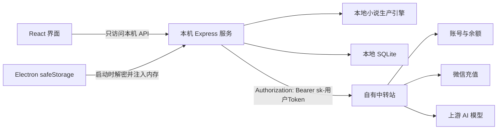

# 桌面端用户级 `sk-` Token、同步注册与充值闭环实施方案

> 状态：认证方向已确认，等待中转站字段契约冻结后实施
> 创建日期：2026-07-28
> 适用产品：0xNovelAgent Windows 本地 EXE
> 关联总纲：[本地 EXE 创作平台 SaaS 重构总纲](./local-exe-saas-rebuild-plan.md)
> 决策优先级：本文替代总纲中关于设备 ID、设备 Token、Access/Refresh 双 Token 和设备管理的旧设想。

## 1. 架构决策

0xNovelAgent 不引入设备 Key、设备 Token 或第二套桌面身份。

正式采用以下认证方式：

> 用户在 0xNovelAgent 注册或登录中转站账号后，中转站直接返回该用户的 `sk-` Token；本机服务使用这枚 Token 调用 AI、查询余额、查询消费日志和发起充值。

该 `sk-` Token 是用户级服务凭证，不是设备级凭证。

确定规则：

- 中转站是用户、余额、充值订单和消费记录的唯一数据源。
- 本地不建设第二套 User、Wallet、Subscription 或 Payment 数据表。
- 注册成功后同步返回用户信息与 `sk-` Token。
- 登录成功后返回或恢复同一个可用 `sk-` Token。
- 一个用户第一版只维护一个 0xNovelAgent 专用 Token。
- Token 归属用户余额，AI 费用从该用户余额扣除。
- Token 用于 AI、余额、消费记录和充值接口。
- Token 不向普通用户展示，也不要求用户手工复制。
- Token 使用 Electron `safeStorage` 加密保存。
- 小说正文、角色、世界观、章节、任务和版本继续保存在本地。
- 第一版只做充值余额和按量扣费，不做会员订阅。

## 2. 为什么取消设备 Key

设备 Key 只有在以下条件成立时才有额外安全价值：

- 每台设备独立签发。
- 每台设备可以独立吊销。
- 每个 Key 具有设备级权限范围。
- 中转站维护设备列表和远程退出。

当前产品没有建设上述设备管理能力的必要。若设备 Key 和用户 Token 具有相同权限、相同存储方式和相同生命周期，它只会增加：

- 二次签发。
- Token 映射。
- 设备 ID 管理。
- 登录恢复分支。
- 用户换机和吊销逻辑。
- 中转站与客户端维护成本。

因此第一版不做：

- 设备 ID。
- 设备 Key。
- 每台电脑一个 Token。
- `/api/token` 二次创建链路。
- `/api/user/token` 交换链路。
- Access Token / Refresh Token 双 Token。
- 设备列表和远程退出。

未来只有在真实出现“多设备单独退出、设备风险控制、企业席位”等需求时，再独立设计设备会话系统。

## 3. Token 的准确职责

### 3.1 用户级 `sk-` Token 负责

- 调用 OpenAI-compatible AI 接口。
- 查询当前用户余额。
- 查询当前用户消费日志。
- 查询充值配置。
- 创建当前用户的充值订单。
- 查询当前用户自己的支付订单。
- 将 AI 费用归属到正确用户。

### 3.2 用户级 `sk-` Token 不负责

- 保存用户密码。
- 代表管理员权限。
- 访问其他用户数据。
- 同步小说正文到云端。
- 标识具体电脑。
- 防止本机系统被完全攻破后的凭证窃取。
- 单独解决 AI 请求重复扣费。

请求幂等、防重复扣费和结果恢复仍需要中转站按请求维度实现。

### 3.3 Token 与密码的关系

密码只用于注册和登录。

注册或登录成功后：

```text
账号密码
  -> 中转站验证身份
  -> 返回用户信息与 sk-Token
  -> 客户端立即清除密码状态
  -> 后续服务调用只使用 sk-Token
```

客户端不得保存密码。

用户界面可以提供“保持登录”，实现用户理解中的“记住账号密码”效果，但技术实现必须是：

- 可选保存非敏感账号标识，用于下次预填。
- 使用 `safeStorage` 加密保存登录成功后返回的 `sk-` Token。
- 下次启动使用 Token 恢复登录，不重放账号密码。
- 密码只在本次登录请求的内存中短暂存在，请求完成后立即清除。
- Token 失效时允许预填账号，但必须要求用户重新输入密码。

## 4. 产品登录边界

已确认：

- 首次使用必须登录或注册。
- 不提供未登录游客模式。
- 没有有效登录身份时，不允许进入首页、作品列表、编辑器或其他主应用路由。
- 注册成功后直接视为已登录，不再要求登录第二次。
- 启用“保持登录”且 Token 有效时，后续启动自动进入产品。
- 余额为零仍可进入软件和查看本地作品。
- 余额为零时阻止新的付费 AI 调用并引导充值。

建议保留的本地能力：

- 已成功登录过的用户断网后可以打开本地作品。
- 离线时允许手动编辑、保存、导出和备份。
- 离线时禁用 AI、余额刷新、消费记录和充值。
- 联网后自动验证 Token 并恢复服务状态。

这样可以同时满足“必须有账号”和“本地运行”的产品承诺。

这里的“强制登录”指必须具有有效用户身份，不是每次启动都要求重新输入密码。已经在本机成功登录并安全保存凭证的用户，可以自动恢复身份。

### 4.1 全新本地数据域

新版本不迁移旧作品，直接使用全新的 C 端数据链路。

已确认：

- 不检测或导入旧版本小说。
- 不绑定旧版本作品到新账号。
- 不恢复旧任务、导演跟踪、质量债务或运行状态。
- 不迁移旧 Provider、API Key、模型路由或其他专业配置。
- 不建设旧数据映射、迁移向导和兼容恢复入口。
- 新版本只展示登录后在新数据域中创建的作品。

实现边界：

- 新版本使用独立于旧版本的本地数据目录或数据库文件。
- 如果 Electron 仍复用同一个 `userData` 根目录，新数据库也必须使用独立子目录或文件名，不能直接在旧数据库上原地迁移。
- 新作品在创建时写入当前用户 ID，后续本地查询按当前用户隔离。
- 退出登录删除本机凭证，但不删除新版本作品。
- 其他账号登录时默认看不到当前用户的新版本作品。
- 安装、升级和首次启动不得自动删除、清空或覆盖旧数据。
- 旧数据仅保留在原位置，必要时仍可通过旧版本或人工备份处理，但不进入新产品范围。

因此新版本首次启动不显示“发现旧作品”“正在迁移数据库”或“绑定旧作品”等流程。登录成功后直接进入没有作品的新用户首页。

## 5. 总体架构



强制边界：

- React 页面不直接调用中转站。
- React 页面不读取完整 `sk-` Token。
- 中转站请求统一由本机 Express 服务发起。
- Token 只存在于 Electron 加密存储和本机服务内存。
- 本机服务继续只监听 `127.0.0.1`。
- 本机 API 增加每次启动随机会话令牌，避免其他网页调用。
- 所有日志统一脱敏 `Authorization`、Cookie 和密码。

## 6. 中转站统一响应契约

### 6.1 注册

建议内部接口：

```http
POST /api/internal/0xnovel/register
Content-Type: application/json
```

请求字段以中转站实际注册规则为准，至少包括：

```json
{
  "username": "demo",
  "password": "用户输入的密码",
  "email": "按站点配置决定是否必需",
  "verificationCode": "按站点配置决定是否必需"
}
```

成功响应：

```json
{
  "success": true,
  "message": "",
  "data": {
    "user": {
      "id": 123,
      "username": "demo",
      "displayName": "demo",
      "group": "default"
    },
    "token": "sk-xxxxxxxx",
    "tokenType": "Bearer"
  }
}
```

服务端规则：

- 创建中转站用户。
- 为用户创建一个 0xNovelAgent 专用 `sk-` Token。
- Token 名称固定使用可识别名称，例如“0xNovelAgent 默认令牌”。
- Token 归属该用户。
- 注册成功时直接返回完整 Token。
- 注册请求重复到达时不得重复创建用户或多个默认 Token。

### 6.2 登录

建议内部接口：

```http
POST /api/internal/0xnovel/login
Content-Type: application/json
```

请求：

```json
{
  "username": "demo",
  "password": "用户输入的密码"
}
```

成功响应与注册一致：

```json
{
  "success": true,
  "message": "",
  "data": {
    "user": {
      "id": 123,
      "username": "demo",
      "displayName": "demo",
      "group": "default"
    },
    "token": "sk-xxxxxxxx",
    "tokenType": "Bearer"
  }
}
```

服务端规则：

- 验证账号密码。
- 查找当前用户的 0xNovelAgent 专用 Token。
- Token 存在且可用时返回原 Token。
- Token 不存在、被删除或明确轮换后，创建新 Token 并返回。
- 同一用户第一版只保留一个当前有效的 0xNovelAgent Token。

### 6.3 为什么登录也必须返回 Token

只在注册时返回 Token 无法覆盖：

- 用户换电脑登录。
- 用户退出后重新登录。
- 本地凭证文件丢失。
- 注册成功但客户端没有收到响应。
- Token 被中转站删除或轮换。
- 用户重装软件。

因此注册和登录必须调用同一个“查找或创建 0xNovelAgent Token”服务。

### 6.4 退出登录

普通退出登录：

- 清除本机 `safeStorage` 中的 Token。
- 清除本机服务内存中的 Token。
- 保留中转站用户 Token。
- 保留本地小说数据。
- 返回登录页。

普通退出不吊销中转站 Token，因为它是用户级 Token，直接吊销可能影响该用户在其他安装中的使用。

未来可增加：

- “退出全部设备”：轮换用户级 Token。
- “账号安全”：管理员吊销并重新生成 Token。

## 7. 现有接口映射

| 产品能力 | 接口 | 鉴权 |
|---|---|---|
| 同步注册 | 内部注册接口 | 公开 |
| 登录 | 内部登录接口 | 公开 |
| AI 调用 | `/v1/*` | `sk-` Bearer |
| 查询余额 | `GET /api/usage/balance` | `sk-` Bearer |
| 查询消费日志 | `GET /api/usage/logs` | `sk-` Bearer |
| 查询支付配置 | `GET /api/usage/payment/info` | `sk-` Bearer |
| 微信 Native 下单 | `POST /api/usage/payment/wechat/native` | `sk-` Bearer |
| 查询支付订单 | `GET /api/usage/payment/orders/{orderNo}` | `sk-` Bearer |
| 查询公开价格 | `GET /api/pricing` | 公开 |

不进入 0xNovelAgent 主链：

- `GET /api/user/token`。
- 用户手工创建 Token 的控制台流程。
- 设备 Token 列表。
- 会员与订阅接口。

## 8. 客户端认证状态机

```text
anonymous
  -> authenticating
  -> verifying_token
  -> ready

ready
  -> insufficient_balance
  -> offline_authenticated
  -> token_invalid

token_invalid
  -> authenticating
  -> verifying_token
  -> ready
```

| 状态 | 用户界面 | 允许操作 |
|---|---|---|
| `anonymous` | 登录/注册页 | 登录、注册、找回密码 |
| `authenticating` | 正在登录 | 禁止重复提交 |
| `verifying_token` | 正在准备创作服务 | 验证 Token 与余额 |
| `ready` | 正常产品界面 | 本地编辑、AI、充值 |
| `insufficient_balance` | 余额不足提示 | 本地编辑、查看作品、充值 |
| `offline_authenticated` | 离线提示 | 查看、编辑、保存和导出本地作品 |
| `token_invalid` | 登录已失效 | 重新登录获取 Token |

## 9. 同步注册流程

1. 用户在 0xNovelAgent 注册页填写信息。
2. React 把表单提交给本机 `/api/relay/auth/register`。
3. 本机服务调用中转站同步注册接口。
4. 中转站创建账号及默认 0xNovelAgent Token。
5. 中转站返回用户摘要和完整 `sk-` Token。
6. 本机服务验证返回结构。
7. Electron 使用 `safeStorage` 加密保存 Token。
8. 本机服务只在内存中保留 Token。
9. 本机服务调用 `/api/usage/balance` 验证 Token。
10. 验证成功后进入首页。

异常恢复：

- 注册成功但客户端未收到响应：用户直接登录，不重复注册。
- 注册成功但余额验证失败：保留凭证并提示服务暂不可用。
- Token 无效：清除 Token 并要求重新登录。
- 用户名或邮箱已存在：引导用户登录。

## 10. 登录流程

1. 用户提交账号密码。
2. 本机服务调用中转站内部登录接口。
3. 中转站返回用户摘要和可用 `sk-` Token。
4. Electron 加密保存 Token。
5. 本机服务清除密码变量。
6. 本机服务调用余额接口验证 Token。
7. 成功后进入首页。

登录响应不得只返回 Session Cookie。0xNovelAgent 需要直接得到可用于 AI、余额和充值的 `sk-` Token。

## 11. 启动恢复

### 11.1 单窗口启动原则

正式版用户双击 EXE 后只允许出现一个 0xNovelAgent 产品窗口。

- 不弹出 CMD、PowerShell、Node.js、服务端日志或调试控制台。
- 不为启动页、登录页和主应用分别创建多个可见窗口。
- 启动准备、登录注册和主应用在同一个 Electron 窗口内切换。
- 本机 Express 服务及其他子进程必须静默启动。
- Windows 正式包启动子进程时启用隐藏窗口能力，不通过可见 Shell 承载服务。
- 子进程标准输出写入受控的本地诊断日志，不直接展示给普通用户。
- 开发模式可以保留显式日志，但不得影响正式安装包。

初始化期间在同一个窗口内显示产品化状态：

> 正在准备你的创作空间……

启动失败时显示可理解的错误和“重试”“导出诊断信息”，不得直接展示端口、进程退出码、堆栈或服务名称。

### 11.2 凭证恢复流程

1. Electron 创建唯一产品窗口，并进入内部启动准备页。
2. Electron 静默启动本机服务，不创建额外可见窗口。
3. Electron 检查本地是否存在加密 Token。
4. 存在时使用 `safeStorage` 解密。
5. 通过一次性本机启动令牌将 Token 注入服务内存。
6. 本机服务查询余额验证 Token。
7. 验证成功进入 `ready` 并打开主应用。
8. 没有凭证时进入 `anonymous`，只允许访问登录和注册页。
9. 网络不可用且本机有历史成功登录身份时进入 `offline_authenticated`。
10. 返回 401 时清除 Token 并进入 `token_invalid`。

```text
双击 EXE
  -> 同一个窗口显示启动准备
  -> 后台服务静默初始化
  -> 检查加密登录凭证
     -> 无凭证：强制登录或注册
     -> 凭证有效：自动进入主应用
     -> 凭证失效：清除 Token，要求重新登录
     -> 断网且有历史身份：进入离线编辑
```

## 12. Token 安全存储

### 12.1 计划新增

```text
desktop/src/runtime/relayCredentials.ts
```

职责：

- 使用 Electron `safeStorage` 加密 Token。
- 解密 Token。
- 删除 Token。
- 判断系统加密存储是否可用。
- 保存非敏感用户摘要。
- 保存“保持登录”偏好。
- 可保存用于预填的非敏感账号标识，但不得保存密码。

### 12.2 禁止存储位置

Token 不得写入：

- Prisma/SQLite。
- `localStorage`。
- Zustand 持久化。
- `.env`。
- 普通 JSON 配置。
- 启动参数。
- 日志。
- 崩溃报告。
- Query Cache。

账号密码不得以任何形式写入上述位置，也不得交给浏览器密码存储、renderer 持久化状态或应用自建“密码记忆”文件。

### 12.3 前端不可见

React 只能读取：

```json
{
  "authenticated": true,
  "user": {
    "id": 123,
    "username": "demo",
    "displayName": "demo"
  }
}
```

本机认证接口的响应中不得返回完整 Token。

## 13. LLM 对接

本机服务新增隐藏 `relay` Provider：

```text
provider = relay
baseURL = 中转站 OpenAI-compatible 地址
apiKey = safeStorage 恢复后注入的用户 sk-Token
requestProtocol = openai_compatible
```

保留：

- 现有 `getLLM()` 工厂。
- 现有任务类型路由。
- 现有结构化输出。
- 现有自动导演和章节生产链。

新手前端隐藏：

- Provider。
- BaseURL。
- API Key。
- temperature。
- maxTokens。
- 任务模型路由。

专家和开发模式可以保留本地直连能力，但必须与普通用户中转站模式隔离。

## 14. 请求记录与扣费关联

每次 AI 请求记录：

- 本地 `taskId`。
- 本地 `stepId`。
- 中转站 `requestId`。
- 产品创作模式。
- 模型别名。
- Prompt 版本。
- 输入和输出 Token 数。
- 实际扣费。
- 开始和结束时间。
- 是否流式。
- 是否重试。

禁止记录：

- 完整 `sk-` Token。
- Authorization Header。
- 密码。
- Cookie。

## 15. 幂等边界

用户 `sk-` Token 只解决身份和扣费归属，不解决重复扣费。

中转站仍需支持：

```http
Idempotency-Key: {taskId}:{stepId}:{attemptGroup}
```

规则：

- 相同幂等键只能扣费一次。
- 执行中返回原请求状态。
- 已完成返回原结果或结果引用。
- 明确重新生成时使用新的 `attemptGroup`。
- 客户端重启后可以按幂等键查询原请求。

### 15.1 创作操作预算

逐章生成、连续创作和阶段审校需要在请求幂等之外增加操作级消费预算。

每次用户确认付费创作时创建一个根操作，例如：

```text
creationOperationId
operationType
estimatedChapterMin
estimatedChapterMax
estimatedCostMin
estimatedCostMax
maxSpendAmount
currency
stopBoundary
```

规则：

- 单章模式的根操作只覆盖下一章和完成该章所必需的状态同步。
- 连续创作的根操作只覆盖当前剧情阶段，并携带用户确认的 `maxSpendAmount`。
- 阶段审校和卷末审校使用独立根操作，不沿用正文生成预算。
- 每次模型调用同时关联根操作、本地任务、步骤和请求幂等键。
- 发起新的付费调用前查询根操作累计实际消费。
- 下一笔调用可能超过上限时先暂停，不允许事后仅靠提示补救。
- 正常重试复用原幂等键和原消费记录；明确重新生成才创建新 `attemptGroup`。
- 余额不足、网络中断、客户端关闭和进程重启都保留根操作和恢复位置。
- 操作结束、暂停或中断后向前端返回累计实际消费。
- 估算和实际消费统一使用用户可理解的人民币金额；内部 Token 和 Quota 不直接展示。

连续创作上线前，中转站必须提供或允许可靠计算：

- 公开价格与币种。
- 人民币充值和内部计量单位的换算。
- 请求级实际扣费。
- 根操作累计消费查询或等价的可靠汇总能力。

若无法可靠强制消费上限，第一版只能开放逐章确认，不能开放无边界连续创作。

## 16. 充值闭环

流程：

1. 使用用户 Token 查询 `/api/usage/payment/info`。
2. 显示最低充值金额和固定金额。
3. 用户选择金额。
4. 创建微信 Native 订单。
5. 根据 `codeUrl` 生成二维码。
6. 每 2 至 3 秒查询订单状态。
7. `paid` 后刷新余额。
8. 显示最新余额。

必须处理：

- `pending`。
- `paid`。
- `expired`。
- `failed`。
- 页面关闭后恢复订单。
- 已支付但余额暂未刷新。
- 网络中断后继续查询原订单。

第一版不做：

- 会员订阅。
- 自动续费。
- 邀请返利。
- 签到。
- 兑换码。
- 国际支付方式。

## 17. 前端页面

### 17.1 登录与注册

计划目录：

```text
client/src/pages/auth/
  AuthGate.tsx
  LoginPage.tsx
  RegisterPage.tsx
  ForgotPasswordPage.tsx
  components/
```

要求：

- 不出现“中转站”“API Key”“Token”等术语。
- 未认证时使用 `AuthGate` 阻止访问所有主应用路由。
- 登录页提供“保持登录”，默认开启。
- “保持登录”通过加密 Token 恢复会话，不保存明文或可逆密码。
- 可以预填上次使用的账号标识，Token 失效后仍要求重新输入密码。
- 注册成功后直接进入产品。
- 登录完成后显示“正在准备创作服务”。
- 不允许重复点击造成重复注册。
- 区分密码错误、验证码错误、网络错误和服务不可用。

### 17.2 账户与充值

计划目录：

```text
client/src/pages/account/
  AccountPage.tsx
  RechargeDialog.tsx
  UsageHistory.tsx
```

普通用户只看到：

- 用户信息。
- 创作余额。
- 充值入口。
- 最近消费。
- 退出登录。

普通用户默认不看到：

- Quota。
- Prompt Token。
- Completion Token。
- 模型内部名称。
- API Key。
- Request ID。

## 18. 本机接口

计划新增：

```text
POST   /api/relay/auth/register
POST   /api/relay/auth/login
GET    /api/relay/auth/session
POST   /api/relay/auth/logout
GET    /api/relay/usage/balance
GET    /api/relay/usage/logs
GET    /api/relay/payment/info
POST   /api/relay/payment/wechat/native
GET    /api/relay/payment/orders/:orderNo
```

中转站适配器统一放置在：

```text
server/src/relay/
  auth/
  client/
  usage/
  payment/
  llm/
  http/
```

业务模块不得直接拼接中转站 URL。

## 19. 工程任务树

### UT-0：冻结中转站契约

- [ ] 确认注册请求字段。
- [ ] 确认登录请求字段。
- [ ] 确认注册和登录都返回 `sk-` Token。
- [ ] 确认 Token 对 AI、余额、日志和充值接口均有效。
- [ ] 确认同一用户默认 Token 的查找或创建规则。
- [ ] 确认 Token 轮换和失效规则。
- [ ] 确认余额单位和充值换算。
- [ ] 确认 AI BaseURL、流式和结构化输出。
- [ ] 确认幂等和请求恢复能力。

验收：

- Apifox 中存在准确请求、响应和错误示例。
- 注册、登录、余额、充值和 AI 调用形成一条可测试链路。

### UT-1：共享类型

计划涉及：

```text
shared/types/relayAuth.ts
shared/types/relayUsage.ts
shared/types/relayPayment.ts
shared/index.ts
```

- [ ] 定义用户摘要。
- [ ] 定义认证状态。
- [ ] 定义余额、日志和订单。
- [ ] 定义统一错误码。
- [ ] 使用 Zod 校验中转站响应。

### UT-2：Electron 安全凭证

计划涉及：

```text
desktop/src/runtime/relayCredentials.ts
desktop/src/main.ts
desktop/src/preload.ts
```

- [ ] 使用 `safeStorage` 加密 Token。
- [ ] 启动时向本机服务注入 Token。
- [ ] 退出时清除本地 Token。
- [ ] 禁止向 renderer 暴露 Token。
- [ ] 验证重启恢复。
- [ ] 实现“保持登录”偏好，不保存密码。
- [ ] 正式包只显示一个产品窗口。
- [ ] 正式包隐藏本机服务和其他子进程控制台。
- [ ] 将启动日志写入受控诊断文件并对用户显示产品化错误。

### UT-3：本机中转站适配层

计划涉及：

```text
server/src/relay/
```

- [ ] 实现注册和登录。
- [ ] 实现 Token 内存凭证仓库。
- [ ] 实现余额和消费记录。
- [ ] 实现微信充值和订单查询。
- [ ] 实现日志脱敏。
- [ ] 映射 401、429、余额不足和网络错误。

### UT-4：登录门和账户 UI

计划涉及：

```text
client/src/pages/auth/
client/src/pages/account/
client/src/router/
client/src/api/relay/
```

- [ ] 首次启动登录门。
- [ ] 同步注册。
- [ ] 登录恢复。
- [ ] 未认证用户无法访问任何主应用路由。
- [ ] 登录页默认开启“保持登录”。
- [ ] Token 失效时预填账号并要求重新输入密码。
- [ ] 账户余额。
- [ ] 充值二维码。
- [ ] 订单轮询。
- [ ] 消费明细。
- [ ] 退出登录。

### UT-5：LLM Relay Provider

计划涉及：

```text
server/src/llm/factory.ts
server/src/llm/modelRouter.ts
server/src/relay/llm/
```

- [ ] 新增隐藏 `relay` Provider。
- [ ] 注入用户 Token。
- [ ] 验证普通文本。
- [ ] 验证流式正文。
- [ ] 验证结构化 JSON。
- [ ] 记录本地任务与中转站请求。
- [ ] 处理余额不足和 Token 失效。

### UT-6：幂等与异常恢复

- [ ] 注册响应丢失后通过登录恢复。
- [ ] Token 丢失后通过登录恢复。
- [ ] AI 重试不重复扣费。
- [ ] 支付页面关闭后恢复订单。
- [ ] 离线状态允许本地编辑。
- [ ] Token 轮换后旧 Token 立即失效。

## 20. 验收标准

### 20.1 认证

- [ ] 首次启动必须登录或注册。
- [ ] 注册成功直接获得可用 Token。
- [ ] 登录成功返回或恢复可用 Token。
- [ ] 不需要用户手工复制 API Key。
- [ ] Token 可以查询余额并调用真实模型。
- [ ] 退出登录清除本机凭证但保留本地小说。
- [ ] 未登录用户无法绕过登录页进入主应用。
- [ ] 保持登录后重启 EXE 可以自动恢复身份。

### 20.2 安全

- [ ] React 无法读取完整 Token。
- [ ] SQLite、localStorage、日志和错误报告中不存在 Token。
- [ ] 本机任何持久化位置都不存在账号密码。
- [ ] Token 使用 `safeStorage` 加密。
- [ ] 本机服务只监听 `127.0.0.1`。
- [ ] 本机 API 有启动会话令牌保护。
- [ ] Authorization 和密码日志被脱敏。

### 20.3 AI 与计费

- [ ] 同一 Token 可调用 AI、余额、日志和充值接口。
- [ ] 结构化 JSON 和流式输出通过验证。
- [ ] 余额不足不会启动新的付费任务。
- [ ] 每笔消费可以关联到本地任务。
- [ ] 相同幂等请求不会重复扣费。
- [ ] 单章、连续创作和阶段审校使用独立根操作预算。
- [ ] 连续创作可以强制执行用户确认的人民币消费上限。
- [ ] 达到上限后不会发起新的付费调用。
- [ ] 余额不足或程序重启后可以从原操作恢复。
- [ ] 操作完成、暂停或中断后可以查询实际总消费。

### 20.4 充值

- [ ] 可以查询充值配置。
- [ ] 可以创建微信 Native 订单。
- [ ] 可以展示二维码。
- [ ] 可以处理完整订单状态。
- [ ] 支付成功后余额自动刷新。
- [ ] 页面关闭后可以恢复未完成订单。

### 20.5 离线

- [ ] 从未登录过的安装离线时不能进入主应用。
- [ ] 已登录用户离线时可以编辑本地作品。
- [ ] 离线时 AI 和充值明确不可用。
- [ ] 联网后自动恢复余额和 AI 状态。

### 20.6 桌面启动体验

- [ ] 双击正式版 EXE 只出现一个产品窗口。
- [ ] 正式版不出现 CMD、PowerShell、Node.js 或服务日志窗口。
- [ ] 启动准备、登录注册和主应用在同一个窗口内切换。
- [ ] 启动失败只展示可理解的产品文案，并允许重试或导出诊断信息。

## 21. 测试矩阵

| 场景 | 预期 |
|---|---|
| 新账号正常注册 | 返回用户和 Token，进入首页 |
| 用户名或邮箱已存在 | 引导登录 |
| 注册成功但响应丢失 | 登录后恢复同一个 Token |
| 正常登录 | 返回或恢复用户 Token |
| 勾选保持登录后重启 | 不要求重新输入密码，Token 验证成功后直接进入主应用 |
| 未勾选保持登录后重启 | 不恢复凭证，停留在登录页 |
| Token 失效后重启 | 清除失效 Token，预填账号并要求重新输入密码 |
| 本地 Token 丢失 | 重新登录恢复 |
| Token 被中转站轮换 | 旧 Token 返回 401，要求重新登录 |
| 余额为零 | 可以编辑本地作品，AI 引导充值 |
| 断网启动且有历史登录 | 进入离线编辑状态 |
| 断网启动且从未登录 | 停留在登录页 |
| 充值二维码过期 | 允许重新下单 |
| 已支付但客户端断网 | 恢复网络后查询原订单并刷新余额 |
| AI 流式中断并重试 | 不重复扣费或生成明确的新重试编号 |
| 连续创作达到消费上限 | 当前结果保存，在下一笔付费调用前暂停 |
| 连续创作中途余额不足 | 保存章节和根操作，充值后从原位置继续 |
| 阶段审校 | 使用独立预算，用户确认费用后才启动 |
| `safeStorage` 不可用 | 阻止明文降级并显示错误 |
| 正式安装包启动 | 只出现一个产品窗口，不出现任何技术控制台 |
| 本机服务启动失败 | 同一窗口显示可理解错误，可重试或导出诊断信息 |

## 22. 明确不做

第一阶段不做：

- 设备 Key。
- 设备 ID。
- 多设备会话管理。
- Access/Refresh 双 Token。
- 会员和订阅。
- 自动续费。
- 用户手工管理 API Key。
- 管理员控制台。
- 本地账号密码数据库。
- 小说正文云同步。
- 硬件绑定。

## 23. 实施前阻塞项

1. 中转站内部注册和登录接口的准确字段需要写入 Apifox。
2. 注册和登录返回 `sk-` Token 的正式响应示例需要冻结。
3. 需要确认该 Token 对 AI、余额、日志和充值接口均有效。
4. Token 查找、复用、轮换和失效规则需要确认。
5. AI 文本、流式和结构化输出契约需要完整记录。
6. 中转站 AI 请求幂等和结果恢复契约需要确认。
7. 余额展示币种、人民币充值和内部 Quota 的换算规则需要统一。

上述契约冻结前，可以完成 UI 原型和客户端抽象，但不得把临时字段写死到正式业务代码。
