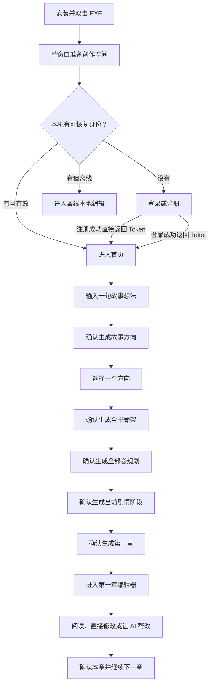
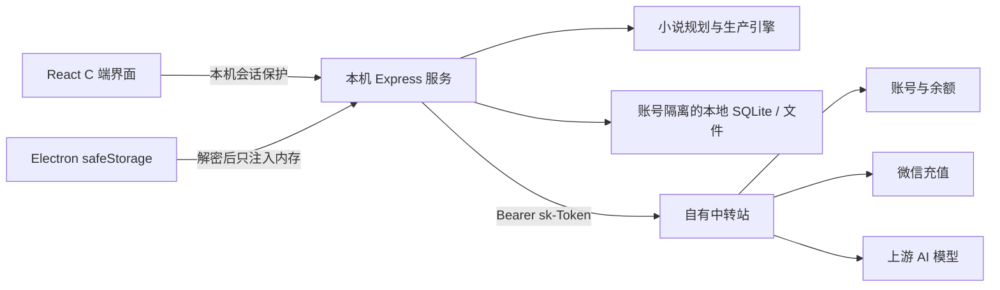

# 0xNovelAgent 本地 C 端 SaaS 完整改造与执行方案

> 文档状态：已整合的唯一产品、架构、实施与验收入口  
> 最后更新：2026-07-28  
> 适用范围：Windows 本地 EXE、React 客户端、本机服务、自有中转站对接、C 端产品流程  
> 目标用户：没有小说创作经验、不了解 AI 模型和软件工程概念的普通用户  
> 实施状态：阶段 0～7 的本地代码与发布门禁已落地；当前不能宣称商业发布完成，仍等待真实中转/支付、商业授权与法务文本、正式签名和全新 Windows 前三章端到端验收  

本文不是 MVP 摘要，也不是单一模块方案。它统一收录 0xNovelAgent 从现有专业 B 端创作系统改造成“本地作品 + 自有中转 SaaS”的 C 端商业产品所需的产品、交互、账户、数据、计费、恢复、安全、工程和验收决策。

此前关于设备 Key、同步注册、`sk-` Token、强制登录、充值、统一首页、一句话新书、五阶段确认、四层规划、文档型工作台、逐章确认、阶段审校、本地数据、多账号隔离、中转站唯一出口、商业风险和实施路线的有效结论，均已归并到本文。

后续产品讨论、排期、开发、评审和验收只以本文为执行依据，不要求再组合阅读其他 MVP、专项方案或历史讨论稿。其他文档仅保留为来源记录或局部代码背景；若与本文冲突，以本文为准。

### 本文使用方式

- 产品评审：先看第 1～19 节，确认用户流程、页面、计费和异常处理。
- 技术设计：看第 14～20 节，确认认证、数据、中转、恢复和系统边界。
- 开发排期：按第 21 节的阶段顺序推进，并使用第 22 节任务清单逐项销项。
- 商业发布：第 23 节门槛必须全部通过，不能以删除许可证文件代替授权或开源履约。
- 阶段验收：使用第 24 节逐项验证；未通过的项目不得标记为完成。
- 当前阻塞：统一记录在第 25 节，不在其他文档维护第二套待办。

---

## 1. 一句话产品定义

0xNovelAgent 是一款面向普通用户的本地 AI 长篇小说创作软件：

- 用户双击 EXE，在一个产品窗口中完成登录、充值、创建故事和持续写作。
- 小说正文、规划、角色、世界、草稿和版本保存在本机。
- 账号、余额、充值、消费和所有 AI 请求由自有中转站提供。
- 用户只需要表达想写什么、确认 AI 给出的方向、阅读和修改章节、决定是否继续。
- 专业的规划、导演、审校、任务、Prompt、模型路由和状态维护由后台完成。

产品成功标准不是“保留旧系统所有页面”，而是：

> 一名没有小说创作经验、不了解模型、Prompt、工作流和审校术语的用户，可以独立完成安装、注册、充值、创建新书、生成第一章并持续写到完整小说。

前三章是第一轮端到端验收门槛，完整小说是长期产品目标。

---

## 2. 已确认的总决策

| 决策项 | 最终决策 |
|---|---|
| 产品形态 | Windows 本地 EXE + 自有中转站 |
| 主要用户 | 零基础普通用户，不以专业作者后台为默认界面 |
| 登录边界 | 强制具有有效登录身份，不提供游客模式 |
| 注册 | 软件内同步注册；注册成功直接返回用户信息与 `sk-` Token，并进入产品 |
| 登录 | 登录成功返回或恢复同一用户可用的 `sk-` Token |
| 保持登录 | 默认开启；加密保存 Token 恢复身份，不保存密码 |
| 设备 Key | 取消，不建设第二套设备身份 |
| AI 出口 | 正式 C 端所有 AI 调用只能经过自有中转站 |
| 模型选择 | 第一版不让用户选择，系统按任务自动路由 |
| 计费 | 与中转站一致，按真实模型调用量扣费 |
| 产品单位 | `1 元人民币 = 1 0x积分` |
| 章节计费 | 下一章任务、正文和必要状态整理统一汇总为“本章消费” |
| 新书初始化 | 故事方向、全书骨架、全部卷规划、当前剧情阶段、第一章分五次确认 |
| 作品存储 | 新版作品全部保存在本机 |
| 多账号 | 同机保留各账号作品，但互相不可见 |
| 换电脑 | 第一版使用本地备份包恢复，不承诺正文云同步 |
| 旧数据 | 不迁移、不扫描、不绑定旧作品和旧任务 |
| 首页 | 统一使用一套根据用户状态自动变化的首页 |
| 主导航 | 首页、我的作品、素材、我的 |
| 工作台 | 左侧作品目录、中间统一编辑器、右侧按需 AI 抽屉 |
| 章节推进 | 第一版逐章确认，不开放连续自动创作 |
| 单章审校 | 不强制深度审校，只做确定性基础检查 |
| 深度审校 | 在剧情阶段或整卷结束时，由用户决定检查或跳过 |
| AI 修改 | 先生成候选稿，用户采用前不得覆盖正文 |
| 创作消息 | 只读“创作进度”，不得承载必须处理但无法点击的操作 |
| 启动体验 | 正式版只出现一个产品窗口，不出现技术控制台和多余弹窗 |
| 商业上线 | 商业授权/开源履约、隐私、支付、签名和外联边界全部通过后才能收费发布 |

---

## 3. 产品原则

### 3.1 新手完成整本小说优先

所有产品、UX、Prompt、Agent 和运行时决策优先服务“新手完成整本小说”。

- 当专家灵活性与新手完成率冲突时，选择更容易完成小说的路径。
- 用户不需要判断该调用哪个内部模块。
- 用户不需要理解结构、节奏、角色弧、伏笔账本、质量债务或任务状态机。
- 系统必须给出默认方案、推荐原因和唯一下一步。
- 高影响变化才要求确认，低风险后台维护不制造用户待办。

### 3.2 AI 与确定性代码的职责

AI 负责：

- 理解用户意图。
- 生成故事方向和规划。
- 判断剧情变化的影响范围。
- 生成章节、候选修改和审校结论。
- 给出下一步推荐和修复建议。

确定性代码负责：

- 登录、权限和账号隔离。
- 输入校验、防重复点击和状态落库。
- Token 安全存储和日志脱敏。
- 自动保存、版本事务和备份恢复。
- 支付订单查询和消费对账。
- 对 AI 结构化结果做校验与安全处理。

不得用关键词、正则或大量固定分支替代本应由 AI 完成的产品判断。

### 3.3 一个页面只突出一个主动作

任何时刻只给普通用户一个视觉上最突出的推荐动作，例如：

- 帮我完善这个故事。
- 就写这个。
- 确认并生成全书骨架。
- 这章可以，继续写下一章。
- 充值并返回。
- 查看调整方案。

其他动作降为次按钮、文字入口或“更多”菜单。

### 3.4 不暴露实现术语

普通用户界面不得直接出现：

- Provider、Base URL、API Key、Token。
- Prompt、temperature、maxTokens、上下文长度。
- 模型倍率、Quota、Token 数和上游币种。
- Replan、Checkpoint、Resume、Takeover。
- 自动导演跟踪、质量债务、资产回灌。
- 数据库、端口、进程、服务名和堆栈。

---

## 4. 产品范围与明确不做

### 4.1 第一阶段必须完成

- 单窗口静默启动。
- 强制登录、同步注册和保持登录。
- 0x积分余额、微信充值、订单恢复和消费记录。
- 全新的账号隔离本地数据域。
- 一句话创建新书。
- 五阶段付费确认。
- 四层滚动规划。
- 文档型单作品创作台。
- 逐章生成、直接编辑、AI 候选稿和历史版本。
- 阶段/卷末可选审校。
- 调整后续剧情。
- 导出、备份和恢复。
- 正式 C 端唯一中转出口。

### 4.2 第一阶段明确不做

- 设备 Key、设备 ID 和设备管理。
- Access Token / Refresh Token 双 Token。
- 游客模式。
- 旧作品、旧任务和旧 Provider 配置迁移。
- 用户 API Key、自定义 Provider、自定义 Base URL。
- 内置供应商直连和正式版专家直连模式。
- 用户选择模型、质量档位或运行参数。
- 多章连续自动创作。
- 正文云同步。
- 会员订阅、自动续费、签到、返利和兑换码。
- 团队协作、社区、内容市场和作品发布平台。
- 手机端。
- 图片、语音和视频生成。
- 普通用户可见的 Prompt、RAG、工作流和任务控制台。

---

## 5. 从安装到第一章的完整流程



### 5.1 安装和启动

用户双击正式版 EXE 后：

1. 只出现一个 0xNovelAgent 窗口。
2. 本机 Express 服务和其他子进程在后台静默启动。
3. 不出现 CMD、PowerShell、Node.js、端口提示或服务日志窗口。
4. 登录、注册、启动准备和主产品在同一个窗口内切换。
5. 初始化时只显示“正在准备你的创作空间……”。
6. 启动失败时只提供“重试”和“导出诊断信息”。

旧版启动时出现的两个技术弹窗在正式 C 端必须取消。

### 5.2 身份恢复

- 本机没有凭证：停留在登录/注册页。
- 加密 Token 有效：自动进入首页。
- Token 失效：预填账号标识，要求重新输入密码。
- 本机有历史成功身份但当前断网：允许进入该账号的离线本地资料域。
- 从未登录过且断网：不能进入主应用。

### 5.3 注册

用户在软件内提交注册信息，本机服务调用中转站内部同步注册接口。

中转站必须在一次成功响应中返回：

```json
{
  "user": {
    "id": 123,
    "username": "demo",
    "displayName": "demo"
  },
  "token": "sk-xxxxxxxx",
  "tokenType": "Bearer"
}
```

客户端安全保存 Token，验证余额接口后直接进入首页，不要求用户再次登录，也不要求复制 API Key。

### 5.4 充值时机

余额为零不阻止登录、查看作品和本地编辑。用户真正确认付费 AI 操作时若余额不足：

```text
保留当前输入和步骤
-> 打开充值
-> 微信扫码
-> 查询原订单
-> 积分到账
-> 返回原位置
-> 用户再次确认
```

支付成功后不能自动替用户发起模型调用。

---

## 6. 信息架构与页面清单

### 6.1 顶层导航

普通用户顶层导航固定为：

1. 首页。
2. 我的作品。
3. 素材。
4. 我的。

“创建作品”是首页和作品列表中的主动作，不单独占据长期导航。“创作”发生在具体作品内。

任务中心、模型路由、Prompt 工作台、运行日志、导演跟进和质量控制台不进入普通用户导航。

### 6.2 七个核心页面

| 页面 | 用户要完成的事 | 必须包含 | 禁止暴露 |
|---|---|---|---|
| 启动与登录 | 注册、登录、恢复身份 | 保持登录、忘记密码、网络和启动错误恢复 | 命令行、端口、Token、Provider |
| 首页 | 立即开始或继续当前任务 | 创建第一部小说、继续作品、恢复中断、离线编辑 | 系统监控、任务统计、模型仪表盘 |
| 我的作品 | 查找和继续本地作品 | 作品名、当前卷章、最近编辑时间、继续创作 | 云同步承诺、内部任务状态 |
| 创建新书 | 从一句话完成五阶段初始化 | 方向、骨架、卷规划、当前阶段、第一章 | 专业规划表单、模型参数 |
| 单作品创作台 | 阅读、编辑和持续生成 | 作品目录、编辑器、AI 候选、版本、逐章确认 | 导演跟踪、质量债务、按钮墙 |
| 我的 | 查看账号、余额和消费 | 充值、订单、消费、换账号、退出登录 | Quota、完整 Token、模型倍率 |
| 本地数据与设置 | 管理本机资料和基础体验 | 导出、备份、恢复、字体、主题、诊断、更新 | Provider、Prompt、Webhook、数据库配置 |

### 6.3 页面内能力

以下能力不创建一级页面：

| 能力 | 放置位置 |
|---|---|
| AI 帮我改 | 创作台右侧按需抽屉 |
| 历史版本 | 创作台“更多”或版本抽屉 |
| 充值 | 我的页面或当前付费动作的充值浮层 |
| 消费明细 | 我的页面中的展开明细 |
| 生成中断 | 当前编辑器状态卡 |
| 调整后续剧情 | 当前章节或故事规划中的流程面板 |
| 创作进度 | 创作台只读历史抽屉 |
| 导出 | 作品“更多”菜单 |

---

## 7. 统一自适应首页

首页只有一套结构，根据当前用户状态替换核心内容。

### 7.1 状态优先级

1. 有需要恢复的本地生成现场：显示继续、保留草稿或查看结果。
2. 有最近作品：显示继续最近作品。
3. 没有作品：显示一句故事想法输入。

余额不足和离线属于能力状态，不覆盖作品上下文。

| 用户状态 | 首页核心内容 | 主动作 |
|---|---|---|
| 首次登录且没有作品 | “你想写一个什么故事？” | 帮我完善这个故事 |
| 已有作品且没有运行操作 | 最近作品、当前进度、推荐下一步 | 继续创作 |
| 正在生成 | 当前作品和已保存进度 | 查看创作进度 |
| 生成中断 | 已保存结果和恢复说明 | 继续当前步骤 |
| 余额不足 | 原作品上下文和轻量提示 | 触发 AI 时充值并继续 |
| 离线且有历史身份 | 最近本地作品 | 继续本地编辑 |

### 7.2 新用户首页

视觉中心固定为：

> 你想写一个什么故事？

唯一必填项是一句话描述。辅助入口只能是：

- 帮我随机想一个。
- 从热门题材开始。
- 查看少量灵感示例。
- 我想多说一点。

统计、资产健康、模型状态、任务数量和余额不得抢占首屏。

### 7.3 返回用户首页

视觉中心固定为：

> 继续创作《作品名称》

展示上次写到的位置、当前作品阶段、推荐下一步及原因，并提供一个最突出的“继续创作”按钮。

---

## 8. 一句话新书创建与五阶段确认

### 8.1 用户只承担两个内容决策

1. 输入一句故事想法。
2. 从 AI 提供的方向中选择一个。

题材、主角、读者感觉、篇幅、卷数和内部规划全部有推荐默认值。

### 8.2 起始想法

输入内容必须实时保存在本地创建草稿中。关闭页面、余额不足、充值跳转和程序重启后都不能丢失。

“我想多说一点”可以补充：

- 题材偏好。
- 主角想法。
- 希望的阅读感觉。
- 不希望出现的内容。
- 大致篇幅。

这些都不是继续创建的前置条件。

### 8.3 故事方向

AI 生成三个真正不同的方向。每个方向至少展示：

- 临时书名。
- 一句话亮点。
- 主角身份。
- 核心矛盾。
- 整体阅读感觉。
- 大致发展方向。
- 推荐篇幅。

主动作是“就写这个”。次要动作是“换一批”“按我的意见调整”和“返回修改想法”。

任何会发起新模型调用的换一批或调整，都必须先显示预计 0x积分。

### 8.4 作品确认卡

选择方向后只展示一张普通用户能理解的确认卡：

- 推荐书名。
- 一句话简介。
- 主角。
- 核心冲突。
- 故事感觉。
- 预计卷数。
- 预计章节范围。

用户可以修改书名、简介、篇幅和感觉，但不进入卷数公式、节奏板和章节合同表单。

### 8.5 五个付费阶段

新书初始化严格分为：

1. 故事方向。
2. 全书骨架。
3. 全部卷规划。
4. 当前剧情阶段。
5. 第一章。

每一步都必须：

1. 说明下一步会生成什么。
2. 显示预计 0x积分范围。
3. 等待用户点击确认。
4. 发起本次模型调用。
5. 保存结果和实际消费。
6. 展示结果。
7. 等待下一次确认。

不得在用户确认故事方向后自动连续扣费执行后四步。

中途退出后显示“作品准备尚未完成，继续准备作品”，从最后一个完整保存的阶段继续。

---

## 9. 四层滚动规划合同

```text
整本故事方向 -> 生成全书骨架
全部卷 -> 生成相对完整的卷规划
当前剧情阶段 -> 生成详细推进计划
下一章 -> 生成具体写作任务
```

### 9.1 全书骨架

负责确定整本小说最稳定的长期方向：

- 核心故事命题。
- 主角最终目标。
- 核心矛盾。
- 主角成长主线。
- 主要对手和压力来源。
- 全书重大转折。
- 结局方向。
- 必须兑现的核心承诺。

### 9.2 全部卷规划

开书阶段生成全部卷的相对完整规划。每卷至少包含：

- 本卷在全书中的作用。
- 开始局面。
- 核心目标和主要冲突。
- 主角阶段成长。
- 关键人物和势力。
- 必须兑现的内容。
- 重大转折和卷末高潮。
- 下一卷牵引。
- 预计章节范围。

不提前生成全书所有章节标题和写作任务。远期卷允许调整，但不能只有一句模糊方向。

### 9.3 当前剧情阶段

系统只详细展开当前正在创作的阶段：

- 阶段目标和起止状态。
- 参与角色。
- 冲突升级路径。
- 需要埋下或兑现的线索。
- 各章大致职责。
- 阶段结束后的新局面。

普通界面使用“当前剧情安排”，不出现 beat、节奏板或拆章等内部术语。

### 9.4 下一章写作任务

系统在用户确认继续下一章后按需准备：

- 开始状态。
- 本章目标。
- 必须发生的事件。
- 必须出场的角色。
- 上一章承接点。
- 不能提前发生的内容。
- 结束状态。
- 章末吸引点。
- 建议篇幅。

用户只看到“继续写下一章”。任务单是内部写作依据，不要求用户维护。

### 9.5 最小影响原则

| 变化 | 默认调整范围 |
|---|---|
| 修改文字表达 | 不改规划 |
| 小型人物或设定事实变化 | 事实状态和下一章任务 |
| 当前章关键事件变化 | 下一章任务和当前剧情阶段 |
| 当前阶段目标变化 | 当前阶段尚未完成部分 |
| 当前卷目标变化 | 当前卷未完成部分，并检查未来卷承接 |
| 核心角色或主线变化 | 当前卷和未来卷 |
| 故事前提或结局变化 | 未来全书骨架和未完成卷规划 |

已完成章节和已完成卷始终受保护，不得被后台自动覆盖。

---

## 10. 单作品文档型创作台

用户进入作品后，默认看到“带作品目录的文本编辑器”，而不是生产控制台。

```text
左侧作品目录 -> 中间统一编辑器 -> 右侧按需 AI 抽屉
```

### 10.1 左侧作品目录

按用户理解的内容组织：

1. 正文
   - 按卷折叠章节。
   - 默认展开当前卷并定位最近章节。
2. 故事规划
   - 作品方向。
   - 全书大纲。
   - 分卷安排。
   - 当前剧情安排。
3. 角色
   - 主要角色。
   - 配角。
   - 角色关系。
4. 世界
   - 世界简介。
   - 核心规则。
   - 势力。
   - 地点。
5. 更多资料
   - 伏笔与线索。
   - 写作素材。
   - 历史版本。
   - 高级诊断。

“正文”始终位于最上方。弱世界观题材不强迫用户先维护完整世界设定。

### 10.2 中间统一编辑器

用户无论打开章节、大纲、卷、角色还是世界资料，都保持“打开一份作品文档”的一致心智。

编辑器至少提供：

- 当前文档标题和所属位置。
- 始终可直接编辑的正文。
- 自动保存状态。
- 保存失败提示和恢复动作。
- 撤销、重做和历史版本。
- 字数或必要的轻量摘要。

### 10.3 右侧 AI 抽屉

AI 抽屉默认可收起，根据当前内容提供少量上下文动作。

正文：

- 自然语言输入“你希望这章怎么调整”。
- 更精彩。
- 更自然。
- 加快节奏。
- 加强情感。
- 修正前后矛盾。

大纲：

- 完善大纲。
- 调整节奏。
- 补充冲突。
- 规划分卷。

角色：

- 完善角色。
- 检查人物动机。
- 梳理角色关系。

世界：

- 完善世界规则。
- 检查设定冲突。
- 补充势力、地点或舞台。

系统自行选择内部导演、生成、修复或审校能力，对用户统一表达为“AI 帮我写”。

### 10.4 顶部操作

作品顶部默认只保留：

- 返回首页。
- 当前作品名称。
- 自动保存状态。
- AI 帮我写。
- 更多。

导出、设置、版本和诊断放入“更多”。生成、修复、跟踪、重规划、审校和模型状态不得平铺成按钮墙。

---

## 11. 章节生成、修改和确认

### 11.1 章节完成后的三个入口

章节生成完成后只突出：

- 主按钮：“这章可以，继续下一章”。
- 次按钮：“AI 帮我改”。
- 更多：“重新生成整章”“查看历史版本”。

正文始终可直接编辑，不设置单独“编辑模式”。

### 11.2 用户手动修改

- 手动编辑、自动保存、采用候选稿和恢复版本都不调用 AI，因此不扣费。
- 用户修改后，主按钮变为“保存当前修改并继续下一章”。
- 下一章以当前保存的正文为基线。
- “这章可以”不是永久锁定，用户以后仍可返回修改。

### 11.3 AI 帮我改

1. 用户描述要求。
2. 显示预计 0x积分。
3. 用户确认后发起调用。
4. AI 结果保存为独立候选稿。
5. 当前正文保持不变。

候选稿只有三个主动作：

- 采用这版。
- 继续调整。
- 保留原文。

“继续调整”是新的付费调用。“采用这版”和“保留原文”不调用 AI。

### 11.4 整章重新生成

放在“更多”菜单中。执行前说明：

- 原版本会保留。
- 本次会产生新的 AI 消费。
- 新结果是候选版本。
- 用户采用后才替换当前正文。

### 11.5 三种内容对象

```text
workingDraft    当前可编辑正文和自动保存内容
aiCandidate     尚未采用的 AI 修改、续写或整章重生成结果
chapterVersion  关键节点的不可变历史快照
```

关键版本节点：

- 初次生成完成。
- 用户确认手动修改。
- 采用 AI 调整。
- 采用整章重新生成。
- 确认当前章并进入下一章。
- 从历史版本恢复。

恢复旧版本时先保留当前版本，再复制旧快照成为新的当前版本。

---

## 12. 审校与持续创作

### 12.1 每章不强制深度审校

每章生成后系统静默完成：

- 正文非空、截断、异常格式和保存状态等确定性基础校验。
- 当前章节版本保存。
- 下一章需要的事实和连续性状态准备。
- 人物、世界和伏笔等必要资料同步或创建可恢复的后台任务。

这些动作不形成用户待办。单章完成后用户只需要阅读、修改或继续。

### 12.2 默认逐章确认

用户点击“这章可以，继续写第二章”后：

1. 保存当前版本为下一章基线。
2. 准备下一章必要事实和写作任务。
3. 生成下一章。
4. 保持在同一个创作台。

不能跳到任务中心、审校页或创作消息页。

### 12.3 第一版不开放连续创作

当前中转站没有已冻结的 AI 请求幂等、结果取回、流式断点续传和操作级消费上限契约。因此第一版只授权下一章，不提供：

- 连续写三章。
- 连续写五章。
- 自动写到当前剧情阶段结束。
- 后台无人值守持续扣费。

中转站将来补齐相关能力后，需要重新评审连续创作，不能直接复用逐章逻辑。

### 12.4 剧情阶段和卷末审校

当前剧情阶段结束时显示：

> 这一段剧情已经完成。

提供：

- 检查这一段剧情后继续。
- 暂不检查，直接继续。

整卷结束时显示：

> 第一卷已经完成。

提供：

- 检查本卷并准备下一卷。
- 跳过检查，直接开始下一卷。

阶段审校检查多章连贯性、人物行为、世界规则、节奏、重复、伏笔和下一阶段承接。结果只展示：

- 整体结论。
- 具体影响位置。
- 一个推荐动作。

不得拆成多个需要用户调度的“质量债务任务”。

### 12.5 创作进度

旧“创作消息”改为只读“创作进度”，记录：

- 章节完成。
- 生成中断。
- 阶段完成。
- 暂停和恢复。
- 已保存结果。

必须由用户处理的动作必须出现在当前章节或阶段结束位置，不能要求用户去消息列表寻找不可点击状态。

---

## 13. 调整后续剧情

普通用户只需要描述“接下来想怎么改”，系统负责判断最小影响范围。

### 13.1 触发时机

- 用户主动点击“调整后续剧情”。
- 用户确认了会改变故事事实的正文修改。
- 当前剧情阶段或当前卷结束。
- 用户修改全书骨架、卷规划或阶段目标。
- 用户主动检查后续计划。

不随每次输入或光标变化实时调用 AI。

### 13.2 影响等级

| 等级 | 典型变化 | 处理 |
|---|---|---|
| 低 | 润色、小型事实变化 | 更新事实和下一章任务，不打断用户 |
| 中 | 当前章关键事件或阶段推进方式变化 | 章末给出简短调整摘要 |
| 高 | 阶段目标、卷目标、核心角色、主线、前提或结局变化 | 下一次付费生成前必须确认方案 |

### 13.3 用户看到的调整方案

页面只回答：

1. 发生了什么变化。
2. 哪些未来内容会受影响。
3. 哪些已有内容保持不变。
4. 系统建议如何继续。

默认只展开一套推荐方案。确认后：

```text
保存当前规划版本
-> 更新受影响的未来规划
-> 更新当前剧情阶段
-> 作废尚未执行的旧章节任务
-> 生成新的下一章任务
-> 返回原编辑位置
```

若调整需要模型调用，执行前显示预计 0x积分。已完成章节和卷不得自动改写。

---

## 14. 账号、Token 与设备 Key

### 14.1 最终认证方案

中转站是用户、余额、充值订单和消费记录的唯一数据源。本地不建设第二套 User、Wallet、Subscription 或 Payment 体系。

注册或登录成功后：

```text
账号密码
-> 中转站验证身份
-> 返回用户信息与 sk-Token
-> 客户端清除密码状态
-> 后续 AI、余额、消费和充值只使用 sk-Token
```

一个用户第一版只维护一个 0xNovelAgent 专用 Token。

### 14.2 取消设备 Key

设备 Key 只有在每台设备独立签发、独立吊销、具有设备级权限和设备管理后台时才有额外保护价值。

当前产品不建设这些能力。若设备 Key 与用户 Token 权限、存储和生命周期相同，它只会增加第二套签发、映射、恢复和吊销逻辑。因此第一版取消：

- 设备 ID。
- 设备 Key。
- 每台电脑一个 Token。
- Token 二次交换。
- 设备列表和远程退出。

未来出现多设备风控、企业席位或单设备退出需求时，再独立设计设备会话系统。

### 14.3 Token 的职责

Token 负责：

- 调用 AI。
- 查询余额。
- 查询消费日志。
- 查询充值配置。
- 创建和查询充值订单。
- 把消费归属到正确用户。

Token 不负责：

- 保存密码。
- 管理员权限。
- 同步小说正文。
- 标识具体设备。
- 防止本机系统被完全攻破。
- 单独解决 AI 重复扣费。

### 14.4 保持登录而非保存密码

“记住账号密码”的用户体验实现为：

- 可保存非敏感账号标识用于预填。
- 使用 Electron `safeStorage` 加密保存登录后的 Token。
- 下次启动使用 Token 恢复身份。
- 密码只在当前登录请求内存中短暂存在。
- Token 失效时要求重新输入密码。

不得把密码写入 SQLite、localStorage、JSON、环境变量、日志或浏览器持久化状态。

---

## 15. 本地数据、账号隔离与备份

### 15.1 全新数据域

新版只处理登录后在新链路中创建的数据：

- 不检测或导入旧小说。
- 不绑定旧作品到新账号。
- 不恢复旧任务、导演状态和质量债务。
- 不迁移旧 Provider、API Key 和模型路由。
- 不在旧数据库上原地改造成新链路。
- 安装、升级和首次启动不得自动删除或覆盖旧数据。

### 15.2 多账号隔离

Token 验证成功后，使用中转站稳定 `userId` 映射本地匿名 `profileId`。

- Token、密码、邮箱和用户名不得出现在数据库或目录名中。
- 每个 `profileId` 使用独立数据库、草稿和备份目录。
- 所有作品、任务、版本和创作操作归属当前资料域。
- 同账号在同机重新登录后重新打开自己的作品。
- 换账号后原账号作品仍保留，但新账号不可见。
- 退出登录只清除凭证，不删除作品。
- 删除本地作品是独立、明确、二次确认的操作。

当前实现使用每台安装随机生成的本地盐，对中转 `userId` 做 HMAC 派生，得到 32 位匿名 `profileId`。正式桌面服务的数据根目录为：

```text
consumer-v1/profiles/<profileId>/
  data/dev.db
  logs/
  storage/
```

首次登录或换账号后，Electron 保存加密凭证并重新启动一次本机服务，使 Prisma 从进程启动起只连接目标资料域数据库。未登录时使用不可创作的匿名资料域；登录门阻止用户在匿名资料域创建作品。

### 15.3 换账号

1. 自动保存当前内容。
2. 若 AI 正在调用，要求先结束当前操作并保留已接收临时正文。
3. 关闭当前资料域。
4. 清除 Token、正文缓存、任务投影和账户余额。
5. 返回登录页。
6. 新账号登录成功后打开自己的资料域。

旧账号的异步回调必须校验原 `profileId`，不得写入新账号数据库。

### 15.4 备份

第一版提供：

- 导出小说。
- 创建本地备份包。
- 从备份包恢复。
- 打开备份目录。

同账号换电脑不会自动出现原电脑作品。备份包记录非明文账号归属指纹，默认只允许同一中转账号恢复。

---

## 16. 自有中转站与唯一 AI 出口

### 16.1 强制边界

- React 页面只访问本机 API，不直接访问中转站。
- 完整 `sk-` Token 不进入 renderer。
- Token 只存在于 Electron 加密存储和本机服务内存。
- 本机服务只监听 `127.0.0.1`。
- 本机 API 使用每次启动随机会话令牌。
- 正式 C 端所有 AI 请求只进入隐藏的 `relay` Provider。
- 修改前端、本地配置、环境变量或数据库也不能恢复第三方直连。
- 中转不可用时保留本地编辑，但 AI 暂停，不降级为直连第三方。

### 16.2 模型策略

第一版由系统按任务类型自动路由模型。用户看不到：

- 供应商名称。
- 模型名称。
- Provider 和 Base URL。
- temperature、maxTokens。
- 模型倍率和 Token。

模型选择和质量档位仅作为未来扩展，不进入第一版设置。

### 16.3 中转接口映射

| 产品能力 | 中转接口 | 鉴权 |
|---|---|---|
| 同步注册 | `POST /api/user/register`；请求字段和 `sk-` 响应结构仍需真实示例确认 | 公开 |
| 登录 | `POST /api/user/login`；请求字段和 `sk-` 响应结构仍需真实示例确认 | 公开 |
| AI 调用 | `/v1/*` | `sk-` Bearer |
| 查询余额 | `GET /api/usage/balance` | `sk-` Bearer |
| 查询消费日志 | `GET /api/usage/logs` | `sk-` Bearer |
| 查询支付配置 | `GET /api/usage/payment/info` | `sk-` Bearer |
| 微信 Native 下单 | `POST /api/usage/payment/wechat/native` | `sk-` Bearer |
| 查询支付订单 | `GET /api/usage/payment/orders/{orderNo}` | `sk-` Bearer |
| 查询公开价格 | `GET /api/pricing` | 公开 |

接口文档入口为 [中转站 Apifox 文档](https://e18xwdzjn3.apifox.cn)。访问凭据不得写入仓库。

2026-07-28 已通过 Apifox 的 `llms.txt` 和各接口 OpenAPI 页面核对：

- 余额、日志、支付配置、微信 Native 下单和订单查询的路径、字段和状态枚举完整。
- 注册与登录页面当前仅使用允许任意字段的 `GenericObject` 请求，以及 `data: string` 的通用响应，不能仅凭文档证明正式字段或 Token 外形。
- 本机适配器支持注册/登录响应直接携带 `sk-` Token；也支持登录 Cookie 后调用 `GET /api/user/token` 的兼容交换，但最终结果必须是 `sk-` Token，并必须通过余额接口验证归属。
- 账户 API 根地址与 OpenAI 兼容模型根地址分别由 `OXNOVEL_RELAY_ACCOUNT_BASE_URL` 和 `OXNOVEL_RELAY_BASE_URL` 配置，避免 `/api/*` 与 `/v1/*` 路径互相污染。

### 16.4 本机适配层

建议目录：

```text
server/src/relay/
  auth/
  client/
  usage/
  payment/
  llm/
  http/
```

业务模块不得直接拼接中转 URL。

本机对前端提供：

```text
POST   /api/consumer/auth/register
POST   /api/consumer/auth/login
GET    /api/consumer/auth/session
POST   /api/consumer/auth/logout
GET    /api/consumer/usage/balance
GET    /api/consumer/usage/logs
GET    /api/consumer/payment/info
POST   /api/consumer/payment/wechat/native
GET    /api/consumer/payment/orders/:orderNo
```

Electron 主进程与本机服务之间另有凭证 Broker 通道。Broker 使用第二枚仅本次启动有效、不会进入 renderer 的随机凭证；只有该通道可以导出或恢复 `sk-` Token。普通本机 API 会话凭证不能读取 Token。

---

## 17. 0x积分、充值和消费

### 17.1 产品计费合同

- 计费与中转站真实模型调用一致。
- 只要实际发起模型调用就会产生消费。
- 产品统一显示“0x积分”。
- `1 元人民币 = 1 0x积分`。
- 不向普通用户展示 Quota、Token、模型倍率或上游币种。
- 用户不满意、放弃候选稿或选择保留原文，不退回已经发生的模型消费。

### 17.2 章节消费

以下必要调用统一归入本章：

- 下一章写作任务。
- 正文生成。
- 必要状态提取。
- 必要结构化整理。
- 用户明确发起的续写、AI 调整或整章重生成。

普通界面默认只显示：

- 本章预计消费范围。
- 本章实际累计消费。

调用级明细仅在用户主动展开对账时显示。

阶段审校和卷末审校是独立付费操作，不归入章节费用。

### 17.3 充值闭环

1. 查询支付配置。
2. 显示最低金额和固定金额。
3. 明确“支付 N 元，到账 N 0x积分”。
4. 创建微信 Native 订单。
5. 展示二维码。
6. 每 2 至 3 秒查询订单状态。
7. 支付成功后刷新余额。
8. 校验余额增长与支付金额一致。
9. 返回用户原操作位置。

必须处理：

- `pending`。
- `paid`。
- `expired`。
- `failed`。
- 页面关闭后恢复原订单。
- 已支付但余额暂未刷新。
- 网络中断后继续查询原订单。
- 支付金额与到账积分不一致。

金额或积分不一致时必须停止自动继续创作并提示联系支持。

---

## 18. 请求边界、恢复和防重复扣费

### 18.1 当前中转能力边界

当前接口文档尚未提供：

- AI 请求幂等键。
- AI 请求运行状态查询。
- 已完成结果取回。
- 流式断点续传。
- 预冻结、结算、失败退款。
- 可强制执行的单操作消费上限。

因此本地 `creationOperationId` 只能用于产品进度、消费汇总和防重复点击，不能宣称它实现了中转级幂等。

### 18.2 第一版保守规则

- 只有确定请求未发送，或中转明确返回未受理且未扣费时，才允许自动重试。
- 请求已发送但结果不确定时，禁止自动重新生成。
- 先刷新余额和消费日志，向用户说明状态。
- 流式过程中持续保存已接收正文。
- 中断后“继续完成本章”以已有正文发起新的续写请求，并形成新消费。
- 客户端重启只恢复本地已保存内容和操作位置，不承诺取回未收到的中转结果。
- 用户明确选择整章重新生成时创建新的消费尝试并保留旧版本。
- 消费日志短时间没有记录，不等于绝对没有扣费。
- 不执行用户不可见的无限自动重试。

### 18.3 本地操作记录

每次付费创作创建根操作：

```text
creationOperationId
profileId
novelId
operationType
estimatedCostMin
estimatedCostMax
currency = 0x积分
status
stopBoundary
```

每个真实模型调用关联：

- 本地任务和步骤。
- 本地尝试编号。
- 能够取得的中转 `requestId`。
- 开始与结束时间。
- 是否流式。
- 是否为续写或重新生成。
- 可取得的实际消费。

任何日志都不得记录完整 Token、Authorization Header、密码或 Cookie。

---

## 19. 用户可见状态与处理流程

| 状态 | 用户看到什么 | 唯一推荐动作 | 系统后台处理 |
|---|---|---|---|
| 正在启动 | 正在准备创作空间 | 等待 | 静默启动本机服务 |
| 未登录 | 登录/注册 | 登录或注册 | 不开放主应用 |
| 正在生成 | 已接收的正文和通俗阶段 | 等待或停止 | 持续保存临时草稿 |
| 章节完成 | 完整正文和本章消费 | 继续下一章 | 保存版本和必要状态 |
| 生成中断且有正文 | 已保存部分正文 | 继续完成本章 | 新建续写调用 |
| 生成中断且无正文 | 本次未得到可用内容 | 重新生成 | 用户确认后创建新调用 |
| 请求结果不确定 | 结果和消费仍在确认 | 查看当前记录 | 刷新余额和消费日志，不自动重试 |
| 余额不足 | 当前内容仍可编辑 | 充值并返回 | 保存原操作位置 |
| 离线 | AI 暂不可用 | 继续本地编辑 | 禁用 AI、支付和余额刷新 |
| Token 失效 | 登录已失效 | 重新登录 | 清除凭证 |
| 阶段结束 | 这一段剧情已完成 | 检查后继续或直接继续 | 等待用户选择 |
| 卷结束 | 本卷已完成 | 检查并准备下一卷或跳过 | 等待用户选择 |
| 高影响剧情变化 | 未来计划需要调整 | 查看调整方案 | 保护已完成内容 |
| 本地保存失败 | 内容尚未安全保存 | 重试保存 | 不继续付费生成 |

内部专业状态统一翻译：

| 内部概念 | 普通用户表达 |
|---|---|
| AI 修复 | 帮我修改 |
| 自动导演跟踪 | AI 正在维护故事一致性 |
| 质量债务 | 发现需要检查的内容 |
| Task Center | 创作进度 |
| Replan | 调整后续剧情 |
| Checkpoint | 已自动保存 |
| 资产回灌 | 作品资料已同步 |
| 运行日志 | 导出诊断信息 |

---

## 20. 技术架构和保留策略

### 20.1 总体架构



### 20.2 现有核心能力保留

| 能力 | 现有位置 | 改造原则 |
|---|---|---|
| 自动导演 | `server/src/services/novel/director/` | 保留为后台引擎，不作为普通用户控制台 |
| 章节生产链 | `server/src/services/novel/runtime/`、`production/` | 保留能力，改为逐章确认和用户化状态 |
| 小说资产 | `server/src/services/novel/`、`character/`、`state/`、`payoff/`、`audit/` | 保留数据能力，重新组织用户入口 |
| Prompt Registry | `server/src/prompting/` | 保留唯一 Prompt 入口 |
| RAG | `server/src/services/rag/` | 保留内部能力，第一版不开放配置 |
| 模型任务路由 | `server/src/llm/modelRouter.ts` | 保留任务分类，输出统一进入 relay |
| LLM 工厂 | `server/src/llm/factory.ts` | 增加正式 C 端中转强制边界 |
| 编辑器 | `client/src/pages/novels/components/chapterEditor/` | 作为新工作台中间主区域 |
| Electron 打包 | `desktop/` | 增加单窗口、静默启动和凭证能力 |

### 20.3 旧 B 端入口处理

正式 C 端不提供运行时专家开关。旧能力按三类处理：

1. 后台继续使用：导演、审校、Prompt、RAG、状态和资产同步。
2. 正式产品不可达：Provider、模型路由、Prompt 工作台、任务控制台和调试入口。
3. 内部研发需要时：只存在于构建时隔离的内部开发包，不能由正式安装包恢复。

### 20.4 前端重点改造位置

- `client/src/router/index.tsx`
- `client/src/components/layout/AppLayout.tsx`
- `client/src/components/layout/Sidebar.tsx`
- `client/src/components/layout/NovelWorkspaceRail.tsx`
- `client/src/pages/Home.tsx`
- `client/src/pages/novels/NovelCreate.tsx`
- `client/src/pages/novels/NovelEdit.tsx`
- `client/src/pages/novels/components/chapterEditor/`
- `client/src/pages/auth/`
- `client/src/pages/account/`

`NovelEdit.tsx` 当前是大型单体文件。实施时必须按明确职责拆分，不能继续扩展到 700 行以上，也不能仅抽取无归属的 `utils`。

---

## 21. 可执行实施路线

实施顺序固定为 0 至 7。每个阶段通过端到端门禁后才能进入下一阶段。

### 阶段 0：冻结商业和运行边界

当前进度：单产品窗口、静默子进程、全新 `consumer-v1` 数据根、服务端 C 端路由白名单、客户端 C 端路由白名单、本机 API 随机会话保护和强制中转策略已经实现并通过代码级验证。商业授权/AGPL 履约路线仍是收费发布门禁，因此阶段 0 不能标记为全部完成。

范围：

- 正式 C 端只允许中转 AI。
- 新旧数据域物理隔离。
- 正式包路由白名单。
- 单窗口静默启动。
- 本机 API 会话保护。
- 明确商业授权或 AGPL 履约路线。

完成标准：

> 双击正式 EXE 只出现一个窗口，只能进入新 C 端链路，旧 B 端和直连模型路径不可达。

门禁：

- 本阶段未完成前，不开放真实付费调用。

### 阶段 1：账号、Token、资料域和充值

当前进度：共享契约、中转适配层、强制登录页、同步注册/登录、Token 内存边界、Windows `safeStorage`、匿名 `profileId` 与独立 SQLite、余额、消费记录、微信 Native 下单和订单恢复已经实现。真实中转认证字段、Token 复用规则和真实小额支付尚待联调。

范围：

- 冻结同步注册和登录接口。
- 注册/登录返回用户信息与 `sk-` Token。
- Electron `safeStorage`。
- 强制登录门和保持登录。
- 稳定 `userId` 到匿名 `profileId` 映射。
- 多账号隔离、换账号和退出。
- 余额、微信充值、订单恢复和消费记录。

完成标准：

> 用户可注册、登录、充值、退出并重新登录；同机不同账号互相不可见，支付 N 元到账 N 积分。

门禁：

- 本阶段未完成前，不把作品绑定到临时账号字段。

### 阶段 2：本地作品数据基础

范围：

- 新作品、规划、章节和创作操作数据。
- `workingDraft`、`aiCandidate`、`chapterVersion`。
- 自动保存和保存失败恢复。
- 导出、备份包和恢复。
- 完全跳过旧数据迁移。

完成标准：

> 即使 AI 暂不可用，用户也能创建作品、编辑正文、切换账号、关闭重开并恢复内容。

门禁：

- 本阶段未完成前，不接入会覆盖或写入正文的 AI 流程。

当前实施结果（2026-07-28）：

- 新增 C 端专用本地作品 API，作品列表、创建、章节创建和读取不再依赖旧 B 端页面。
- `ConsumerChapterDraft` 保存可变工作草稿和光标位置，并使用递增 `revision` 阻止旧窗口覆盖新内容。
- `ConsumerChapterCandidate` 独立保存 AI 候选稿；采用前不修改正文，采用和放弃只能执行一次。
- `ConsumerChapterVersion` 保存内容哈希和章节内递增序号；确认、采用与恢复只新增版本，不修改历史版本。
- `ConsumerCreationOperation` 预留付费创作操作、请求、流式正文、预计/实际积分和结果引用的持久化位置。
- C 端作品列表、创建页和基础文档型创作台已经切换到新链路；编辑器自动保存，确认正文才形成历史版本。
- 用户关闭创作窗口时，Electron 会先等待草稿落盘；保存失败则保留窗口并提示重试。
- 支持导出当前作品文本；导出会优先读取尚未确认但已自动保存的工作草稿。
- 每个账号在自己的资料域内拥有独立 `backups/`；备份使用 SQLite 在线快照，不直接复制正在写入的数据库。
- 单文件备份带账号归属指纹、内容哈希和路径校验；只允许当前账号恢复，恢复前自动创建安全备份。
- 恢复时先完整校验并解包到临时目录，关闭本机服务后再切换数据；旧数据保留在 `restore-recovery/` 以便回退。

工程验证：

- SQLite 与 PostgreSQL Prisma Schema 均通过 `prisma validate`。
- 服务层测试证明工作草稿不会提前覆盖正文、过期 revision 被拒绝、候选稿采用前正文不变、恢复版本会新增快照。
- 备份恢复测试证明跨账号备份被拒绝，恢复后旧资料域仍保留在回退目录。
- 客户端、服务端、共享类型和桌面端类型检查通过。

仍需验收：

- 使用正式 Windows 打包环境完成“编辑后立即关闭—重新打开—内容仍在”的实机检查。
- 使用真实作品完成一次创建备份、导出到外部位置和同账号换机恢复。
- 当前单文件备份上限为 512 MB；超出时明确拒绝，不产生不完整备份。

### 阶段 3：新书五阶段初始化

范围：

- 一句话想法。
- 三个方向候选。
- 故事方向、全书骨架、全部卷规划、当前剧情阶段和第一章。
- 每阶段预计积分、手动确认、实际积分、中断恢复和充值返回。

完成标准：

> 新用户可以从一句话走到第一章，每一次付费生成都由用户单独确认。

门禁：

- 主链未走通前，不开发阶段审校、后续重规划或高级入口。

当前实施结果（2026-07-28）：

- 新增 `ConsumerStorySetup`，用单一 `step + status + revision` 保存故事方向、全书骨架、全部卷规划、当前剧情阶段和第一章的推进状态。
- 五个阶段分别使用注册到 Prompt Registry 的结构化 Prompt；规划任务和正文任务使用不同任务类型，但正式 C 端都由中转模型路由。
- 每次生成先创建唯一 `ConsumerCreationOperation`，Prompt 调用携带本地操作 ID、作品 ID、阶段和 C 端初始化入口信息。
- 客户端 `requestKey` 与本地唯一索引共同保证同一操作不会重复调用；失败或结果未知后必须用新的操作标识手动重试。
- 进程重启发现旧的 `generating` 操作时，将其改为 `outcome_unknown`，明确提示可能产生过消费，不自动重新提交。
- 每个阶段生成完成后停在确认页；确认本身不调用 AI，只推进到下一阶段的“等待生成”状态。
- 故事方向固定返回三个实质不同的选项；用户选择后可修改普通用户可理解的书名和一句话简介。
- 第一章生成结果只写入候选稿，正式正文、工作草稿和不可变版本都要等用户确认后才更新。
- 阶段页提供桌面和窄屏布局、五步进度、实际消费、历史同类调用参考区间、失败恢复与充值入口。
- 中转没有独立计价预估接口时，不伪造固定价格；有历史同类操作时展示最近十次范围，没有样本时明确说明按实际用量计费。

工程验证：

- 共享契约、服务端、客户端生产构建和桌面端类型检查通过。
- SQLite 与 PostgreSQL Prisma Schema 均通过 `prisma validate`。
- 状态机测试覆盖五次生成/五次确认、重复请求幂等、失败后新请求恢复、进程中断结果未知和第一章候选稿采用边界。
- C 端认证、中转边界、本地工作区和备份回归共 14 项通过。
- 浏览器使用模拟本机 API 验证桌面和 390px 窄屏方向选择、确认区展开、主动作状态和无控制台错误。

仍需验收：

- 用真实 `sk-` Token 完成五个结构化模型调用，核对每一步的中转请求、余额差额和消费日志。
- 用正式 Windows 包完成“退出准备页—重启—从最后完整阶段继续”的实机检查。
- 中转提供任务级计价预估或模型费率契约前，首次同类生成只能显示“暂无历史参考，按实际用量计费”，不能承诺一个虚构区间。

### 阶段 4：创作台和逐章生成

范围：

- 左侧作品目录、中间编辑器、右侧 AI 抽屉。
- 逐章确认和下一章任务。
- 流式正文持续保存。
- 中断后保留正文并从已有内容继续。
- 本章消费汇总。
- 创作进度只读历史。

完成标准：

> 零基础用户能够从第一章连续完成到第三章，不需要理解任务、导演、模型和审校。

门禁：

- 完成前三章端到端验收前，不扩展连续创作。

当前实施结果（2026-07-28）：

- 新增下一章生产状态机：用户点击“这章可以，继续下一章”后，系统在同一事务中确认当前正文、保存不可变版本、创建下一章草稿和唯一付费创作操作。
- 每章先由注册 Prompt 生成内部写作任务，再由注册 Prompt 流式生成正文；任务和正文属于同一个 `ConsumerCreationOperation`，用户只看到一次“本章消费”。
- 下一章任务、正文生成和中断续写分别使用 `consumer.chapter.task@v1`、`consumer.chapter.write@v1` 和 `consumer.chapter.continue@v1`，全部经过 Prompt Registry 与自有中转模型路由。
- 流式正文按字符数或时间批量写入 `ConsumerChapterDraft`，并使用 revision 乐观锁；目标章节的正式正文在用户确认前保持不变。
- 同一 `requestKey` 只能幂等返回同一作品、同一章节意图的操作，不能跨章节或跨创作步骤复用。
- Prompt 最近章节上下文只读取来源章节及其之前的内容，不会误读正在生成的目标章或未来章节。
- 失败会保留已接收正文；用户可从现有正文发起新的续写操作。旧进程留下的运行中操作会进入 `outcome_unknown`，不会自动再次扣费调用。
- 工作台右侧只展示当前下一步、生成状态、历史同类消费参考、实际消费和只读创作进度，不暴露任务、模型、导演或审校状态机。
- 桌面端保留左侧章节目录；窄屏端正文优先，目录与历史版本改为可访问对话框，下一步区域排在正文之后，不再挤压编辑器。

工程验证：

- 共享契约、服务端和客户端生产构建通过，桌面端类型检查通过。
- SQLite 与 PostgreSQL Prisma Schema 均通过 `prisma validate`。
- C 端认证、中转边界、初始化、工作区、逐章生产和备份共 18 项聚焦回归通过。
- 逐章测试覆盖请求幂等、跨章节请求标识拒绝、来源确认、不可变版本、流式草稿、目标正文不覆盖、未来章节上下文排除、失败保留和新操作续写。
- 浏览器使用模拟本机 API 验证 1440px 桌面与 390px 窄屏的正常、生成中、生成失败、目录、历史版本和第二章完成状态；确认主动作能进入新章节、正文可回填、实际消费可见，控制台无错误。

仍需验收：

- 用真实 `sk-` Token 连续完成第一章到第三章，核对每章任务与正文调用、余额差额和中转消费日志。
- 用正式 Windows 包验证生成中关闭、进程重启、`outcome_unknown`、从已有正文续写和本地草稿恢复。
- 中转提供任务级计价预估或模型费率契约前，首次同类生成仍只能说明按实际用量计费。
- 左侧故事方向、全书骨架、卷规划和当前剧情阶段目录仍待补齐；“AI 帮我改”、候选稿和版本交互已在阶段 5 完成。

### 阶段 5：AI 修改、候选稿和版本

范围：

- AI 帮我改。
- 快捷意图。
- 候选稿、采用、继续调整和保留原文。
- 整章重新生成。
- 历史版本和非破坏性恢复。

完成标准：

> AI 在用户采用前不会覆盖正文，所有真实调用都有预计和实际消费记录。

当前实现（2026-07-28）：

- 新增 `consumer.chapter.revise@v1` 与 `consumer.chapter.rewrite@v1` 两类正式 Prompt，普通修改和整章重写都通过自有中转模型出口。
- 每次 AI 修改先冻结来源正文、草稿 revision 和正文哈希，再创建独立 `ConsumerCreationOperation`；流式内容只写操作记录，不直接写正文或当前草稿。
- 成功结果写入 `ConsumerChapterCandidate`。用户可查看原文与候选稿、采用、继续调整或保留原文；“继续调整”明确创建新的付费操作。
- 采用候选稿前同时校验草稿 revision 和冻结正文哈希。用户在生成期间或生成后已经改过正文时，旧候选稿会被拒绝，不能覆盖更新后的内容。
- 采用前保存原草稿为不可变版本，采用后保存候选版本；放弃、切换预览、恢复版本和采用动作本身不调用 AI。
- 创作台已接入“AI 帮我改”和“更多 → 重新生成整章”，展示历史同类调用费用区间、实际消费、生成中、失败、结果未知和候选稿状态。
- 桌面端保持“目录—正文—下一步”结构；390px 窄屏正文优先，AI 操作区排在正文后，目录与历史版本进入可访问的对话框。

已验证：

- 共享契约、服务端、客户端生产构建、桌面类型检查以及 SQLite/PostgreSQL 两套 Prisma Schema 校验通过。
- 21 项 C 端聚焦回归全部通过，覆盖候选稿不覆盖正文、请求幂等、继续调整、失败保留原文和局部输出、陈旧候选稿拒绝、逐章生成、五步初始化、认证、中转和备份。
- 模拟中转的真实浏览器验收通过：桌面与 390px 窄屏可完成修改、查看原文、采用、历史版本查看和整章重写，浏览器控制台无错误。

仍需验收：

- 使用真实 `sk-` Token 核对修改与重写的中转消费日志、余额差额、流式响应和失败返回。
- 使用正式 Windows 包验证修改中退出、重启后的候选稿恢复、结果未知状态和陈旧候选稿保护。
- 中转提供任务级计价预估前，首次修改或重写只能提示按实际用量计费；存在历史同类记录后才显示参考区间。

### 阶段 6：阶段审校和后续调整

范围：

- 剧情阶段和整卷结束判断。
- 检查或跳过。
- AI 判断最小未来影响范围。
- 规划版本、差异和恢复。
- 高影响变化在下一次生成前确认。

完成标准：

> 用户不理解审校和重规划术语，也能检查多章质量并改变后续剧情。

当前实现（2026-07-28）：

- 系统根据已确认的当前剧情阶段与卷规划，在阶段末或卷末生成明确检查点；检查点未处理前，服务端禁止直接发起下一章付费生成。
- 当前页面只提供“检查这一段剧情”和“跳过检查，直接继续”两条路径。跳过不是错误，也不会做深度质量判断，只生成下一段创作所必需的详细规划。
- 阶段/卷末检查通过 `consumer.story.review@v1` 生成结构化结果，只展示整体结论、具体影响位置、保持不变的内容和一个推荐动作，不创建普通用户需要调度的质量任务。
- 主动“调整后续剧情”通过 `consumer.story.adjust@v1` 判断低/中/高影响范围；系统优先只调整当前阶段，其次才调整卷规划，只有核心前提或结局确实变化时才调整全书骨架。
- 每个方案开始时冻结规划 revision、规划哈希和全部已完成章节正文哈希。正文或规划在结果返回后发生变化时，旧方案不能覆盖新内容。
- 用户采用方案前不会写入规划；采用后只更新未来规划、清除尚未执行的旧章节任务，并保存调整前后两个不可变规划版本。已完成章节、章节草稿和章节版本不参与写入。
- 阶段检查可“采用推荐方案”或“按原规划进入下一段”；主动调整可“采用推荐方案”或“不调整，保留现有规划”。采用、放弃和恢复规划版本本身不调用 AI。
- 存在尚未确认的后续剧情方案时，服务端禁止下一章付费生成；这条保护不依赖前端按钮状态。
- 创作台左侧与移动目录已加入“故事规划”和“调整后续剧情”。故事规划按最初想法、故事方向、全书骨架、全部卷、当前剧情阶段和规划历史渐进展开。

已验证：

- 共享契约、服务端、客户端生产构建以及 SQLite/PostgreSQL 两套 Prisma Schema 校验通过。
- 26 项 C 端聚焦回归全部通过，新增覆盖检查点阻断、检查后只更新未来、跳过检查、陈旧正文/规划保护和未确认调整阻断下一章。
- 模拟中转的真实浏览器验收通过：桌面端完成阶段检查、采用方案、规划查看、主动高影响调整；390px 窄屏保持正文优先并可查看完整方案；“跳过检查”完成后直接回到下一章主动作。
- 干净浏览器会话控制台错误为 0。

仍需验收：

- 使用真实 `sk-` Token 核对阶段检查、跳过后的阶段规划和主动调整的中转消费日志、余额差额与结构化输出稳定性。
- 使用正式 Windows 包验证检查/调整中退出、进程重启、结果未知、规划版本恢复和多账号资料域隔离。
- 使用真实长篇章节样本校准 16 章上下文窗口、正文截取长度与阶段/卷边界识别，避免超长作品中遗漏关键事实。

### 阶段 7：正式发布收口

范围：

- 离线和全部异常状态。
- 安装、升级、卸载、备份恢复验证。
- 隐私政策和数据删除流程。
- 代码签名、更新检查、日志脱敏和 SBOM。
- 正式构建拒绝旧 B 端入口和所有第三方直连。
- 全新 Windows 环境端到端烟测。

完成标准：

> 全新用户可独立安装、注册、充值并完成前三章；重启、断网、支付中断和换账号不会破坏作品。

当前实现（2026-07-28）：

- C 端本机服务只允许 `/api/health` 和 `/api/consumer/**`；旧小说、任务、RAG、Provider、模型路由和专业工作台 API 在产品模式下统一拒绝。
- 桌面构建使用独立的 C 端路由入口，正式 renderer 不再打包 Prompt 工作台、模型路由、任务中心、导演跟踪、Creative Hub 和系统设置等旧 B 端页面。
- C 端启动时不再启动 RAG、导演、任务恢复、质量债务、Webhook 和旧 Provider 等后台专业服务；正式构建没有可由普通用户恢复的专家直连开关。
- 安装包内固化发布策略，分别声明自有账号 API、自有 AI 中转、自有更新地址和 HTTPS 域名白名单；生产模式拒绝白名单外的中转地址。
- 非 Beta 正式发布必须同时提供 Windows 签名材料和 HTTPS 更新地址；发布脚本不再允许“无签名正式版”旁路。
- 所有子进程日志、HTTP 请求和错误信息统一脱敏并截断；C 端无论环境变量如何设置都禁止记录模型请求、模型响应和完整正文。
- 断网时仍允许浏览本地作品、编辑正文、自动保存、导出和备份；登录、充值和付费 AI 动作在发出请求前即被阻止，并说明联网后如何继续。
- 账户页已提供当前账号备份、恢复和“删除本机数据”。删除必须输入完整确认短语、经过系统确认，并且只把当前账号资料域移入系统回收站，不删除中转账号、余额和消费记录。
- 已提供面向普通用户的使用帮助、隐私与数据说明和桌面更新卡片；技术端口、进程、Provider、Token、Prompt 和任务术语不进入这些页面。
- 发布流水线在打包前执行 C 端边界验证，在打包后检查发布策略和旧页面 chunk，并生成 CycloneDX SBOM 与第三方依赖许可证清单。
- 非工作台窄屏页面使用全宽内容和底部四项导航；章节工作台继续正文优先，不让桌面侧栏挤压编辑空间。

已验证：

- 共享契约、服务端、客户端和桌面端构建通过；32 项 C 端与桌面聚焦回归通过。
- `verify:consumer-release` 通过，证明服务端/客户端边界、强制中转、日志保护、旧后台停用和发布工作流没有无签名旁路。
- `verify:desktop-package` 完成 Windows x64 目录包构建和结构检查；打包产物包含 C 端发布策略，并且不存在旧 B 端路由 chunk。
- 发布元数据生成器产出 CycloneDX 1.5 SBOM 和第三方许可证清单，本次依赖树记录 832 个生产组件。
- 真实浏览器模拟本机 API 验证桌面与 390×844 窄屏的账户、帮助、隐私和工作台流程，控制台错误为 0。
- 离线验证中正文草稿仍成功保存一次，而下一次付费章节请求为 0 次，证明断网不会丢失本地编辑，也不会误发收费调用。

仍需验收：

- 取得实际 Windows 代码签名证书，配置自有正式更新源，并在全新 Windows 机器验证安装、升级、回滚和卸载。
- 使用真实中转完成注册、登录、五阶段初始化、充值、余额/消费对账和前三章连续创作。
- 完成商业授权或律师确认的 AGPL 履约路线，并由法务审核隐私政策、用户协议、退款、支持和账号注销流程。
- 用真实账号验证换账号、重启、支付中断、Token 失效、备份换机恢复和本地数据删除。
- 对生成的 `NOASSERTION` 或信息不完整依赖逐项完成人工许可证审查，不能仅凭生成 SBOM 判定可商用。

---

## 22. 工程任务清单

### 22.1 中转契约

- [ ] 冻结注册请求字段。
- [ ] 冻结登录请求字段。
- [ ] 确认注册与登录都返回完整可用 `sk-` Token。
- [ ] 确认同一用户 Token 的查找、复用、轮换和失效规则。
- [ ] 验证同一 Token 对 AI、余额、日志和充值接口均有效。
- [ ] 验证 AI 普通文本、流式正文和结构化输出。
- [ ] 用真实小额订单验证支付金额与积分到账 1:1。
- [ ] 用真实模型调用验证余额减少与消费日志一致。

### 22.2 桌面运行时

- [x] 正式包只创建一个产品窗口。
- [x] 隐藏本机服务和子进程控制台。
- [x] 实现 Token 加密保存、读取和删除。
- [x] Token 只进入 Electron 主进程加密存储和本机服务内存，不进入 renderer。
- [x] `safeStorage` 不可用时禁止明文降级。
- [x] 增加本机 API 随机启动会话保护。
- [x] 启动错误产品化并支持导出脱敏诊断。
- [x] 正式构建内置自有服务 HTTPS 域名白名单。
- [x] 非 Beta 发布强制代码签名和自有更新地址。
- [x] 正式桌面 renderer 不打包旧 B 端路由。

### 22.3 认证和本地资料域

- [x] 登录门覆盖所有主应用路由。
- [x] 注册成功直接进入产品。
- [x] 保持登录默认开启但不保存密码。
- [x] Token 失效后返回登录页。
- [x] 稳定用户 ID 映射匿名资料域。
- [x] 每个账号使用独立数据库、草稿和备份目录。
- [x] 异步回调强制校验 `profileId`。
- [x] 换账号前保存并关闭当前资料域。
- [x] 提供导出、备份和恢复。
- [x] 提供当前账号本地资料域删除，并使用回收站保留可恢复性。

> 22.3 资料域安全的实现策略（2026-07-28）：每个资料域对应独立 SQLite 文件，服务进程启动时绑定单一文件（`AI_NOVEL_APP_DATA_DIR`），Prisma 是进程级单例。稳态下文件绑定 + 换账号强制重启已经防住跨账号写入，真实风险集中在“换账号到重启完成”这段竞态窗口。因此换账号走“保存当前草稿 → 服务端排空在途操作（`drainInFlightOperations`，把 running 标为 `outcome_unknown`）→ `stopServer` → 清凭证 → `relaunchApp`”的路径（复刻 `desktop:delete-local-profile`），而不是给 `ConsumerCreationOperation` 加 `ownerId` 列做行级守卫。`prepareLogout` 协调器让工作台在停服务前落盘正文；drain 失败是 best-effort，重启后 `reconcileOperation` 会兜底处理残留 running。

### 22.4 中转适配和计费

- [x] 新建 `server/src/relay/` 分层适配。
- [x] 所有已接入中转响应使用共享类型和 Zod 校验。
- [x] 映射 401、429、业务失败、网络错误和服务不可用。
- [x] 认证密码与 Token 不进入请求日志。
- [x] 正式构建强制 `relay` Provider。
- [x] 第一版模型自动路由。
- [x] 当前已接入的 C 端模型调用关联本地创作操作。
- [x] 下一章任务与正文调用汇总为本章消费。
- [x] 支付订单按 `orderNo` 恢复。

### 22.5 C 端前端

- [x] 重构全局路由和四入口导航。
- [x] 实现统一自适应首页。
- [x] 实现一句话新书创建。
- [x] 实现五阶段确认和恢复。
- [x] 重构单作品文档型创作台。
- [x] 删除普通用户可见的专业按钮墙。
- [x] 实现 AI 候选稿和版本交互。
- [x] 实现阶段/卷末审校。
- [x] 实现调整后续剧情。
- [x] 实现账户、充值、消费和本地数据设置。

### 22.6 章节和恢复

- [x] 流式正文持续写入临时草稿。
- [x] 状态不确定时禁止自动重新提交。
- [x] 中断后使用已有正文续写并记录新消费。
- [x] 重启后恢复本地草稿和编辑位置。
- [x] 候选稿跨页面和重启持久化。
- [x] 自动保存与历史版本分离。
- [x] 后台结果不能覆盖用户正在编辑的正文。
- [x] 单章局部质量问题不得伪装成全书失败。

### 22.7 发布与隐私

- [x] C 端断网时允许本地浏览、编辑、保存、导出和备份。
- [x] C 端断网时阻止登录、充值和付费 AI 请求。
- [x] 日志统一脱敏、截断，并禁止记录模型正文。
- [x] 正式 C 端停用旧 RAG、导演、任务恢复和第三方后台服务。
- [x] 发布前执行 C 端边界、旧路由和第三方外联检查。
- [x] 生成 CycloneDX SBOM 和第三方依赖许可证清单。
- [x] 提供普通用户可理解的帮助、隐私与数据说明。
- [ ] 完成法务主体、账号注销、退款和人工支持流程。
- [ ] 使用真实签名证书和自有更新源完成正式发布验证。
- [ ] 在全新 Windows 安装环境完成前三章端到端烟测。

---

## 23. 商业、安全和合规门槛

### 23.1 当前外联结论

现有 Windows 运行时未发现主动向原作者发送数据的遥测、分析、崩溃上报或远程日志。Git `upstream` 和本地许可证文本本身不会在用户启动 EXE 时通知原作者。

但“运行时不会自动通知原作者”不等于“可以闭源商业化”。

### 23.2 许可证是 P0 阻断项

原项目来源曾声明 `AGPL-3.0-only`，并存在服务型商用需另行授权的说明。删除仓库里的许可证文件不会消除原代码的版权或许可证义务，也不会自动产生闭源商业化权利。

收费上线前必须选择并完成一种可审计路线：

1. 取得覆盖桌面端、中转服务、修改、收费、打包和再分发的书面商业授权。
2. 由律师确认完整的 AGPL 履约发布方案。
3. 在法律审查和洁净隔离条件下独立重写。

本文不是法律意见。商业发布前必须由律师核验版权主体、历史贡献者、NOTICE、授权范围和开源履约责任。

### 23.3 收费上线前 P0

- [ ] 商业授权或律师确认的开源履约路线。
- [ ] 权利主体和历史贡献者链条可审计。
- [ ] 商标和商业主体可用。
- [ ] 注册、Token、余额、充值和消费契约真实联调。
- [ ] 隐私政策覆盖正文、提示词、账号、支付和日志。
- [ ] 账号注销、本地数据删除、退款和支持流程。
- [ ] Windows 代码签名和更新签名。
- [ ] 正式包只访问本机、自有中转和显式配置的自有更新站。
- [ ] 所有 AI 请求只能经过中转。

### 23.4 公开测试前 P1

- [x] 本机 API 有随机访问凭据。
- [x] 外部请求统一出口和域名白名单。
- [x] 正式包不存在可恢复第三方直连的专家开关。
- [x] 默认关闭 Webhook、外部 Qdrant、S3、TTS、图片和视频服务。
- [x] 日志不记录 Token、密码、支付凭据和完整正文。
- [x] 生成第三方依赖许可证清单和 SBOM。

---

## 24. 总验收标准

### 24.1 新手体验

- [ ] 用户无需教程即可理解从哪里开始。
- [ ] 无作品用户直接输入一句故事想法。
- [ ] 用户不需要设置模型、Prompt、卷数公式或任务参数。
- [ ] 任一页面只有一个突出主动作。
- [ ] 普通界面不存在 Provider、Token、Quota、导演和任务技术术语。
- [ ] 用户能够独立完成前三章。

### 24.2 登录和启动

- [ ] 正式 EXE 只显示一个产品窗口。
- [ ] 首次使用必须登录或注册。
- [ ] 注册成功直接进入产品。
- [ ] 保持登录后重启可恢复身份。
- [ ] 本机不保存密码。
- [ ] Token 不进入 renderer、SQLite、localStorage 或日志。

### 24.3 新书创建

- [ ] 用户只必须输入想法和选择方向。
- [ ] 三个方向在冲突或发展路径上有实质差异。
- [ ] 五个初始化阶段分别等待确认。
- [ ] 每阶段调用前显示预计积分，完成后显示实际积分。
- [ ] 充值、中断和重启后可以恢复原步骤。
- [ ] 第一章前已有全书骨架和全部卷规划。

### 24.4 创作台

- [ ] 默认看到作品目录和文本编辑器。
- [ ] 左侧一级分组不超过正文、故事规划、角色、世界、更多资料。
- [ ] 正文始终可编辑。
- [ ] AI 修改先生成候选稿。
- [ ] 用户采用前正文不变。
- [ ] 自动保存不会制造大量历史版本。
- [ ] 关键节点有不可变版本。
- [ ] 每章完成后主动作是继续下一章。
- [ ] 用户不需要前往创作消息处理必需动作。

### 24.5 审校和剧情调整

- [x] 每章不强制深度 AI 审校。
- [x] 剧情阶段和卷末允许检查或跳过。
- [x] 跳过不伪装成错误。
- [x] 系统默认选择最小未来影响范围。
- [x] 已完成章节和卷不会被自动覆盖。
- [x] 高影响变化在下一次付费生成前确认。

### 24.6 计费和恢复

- [ ] 余额、预计和实际消费统一显示 0x积分。
- [ ] 支付 N 元到账 N 积分。
- [ ] 一章多次必要调用汇总为本章消费。
- [ ] 放弃 AI 候选不改变正文，但保留消费记录。
- [ ] 第一版不提供连续创作。
- [ ] 状态不确定的请求不自动重试。
- [ ] 流式中断保留已接收正文。
- [ ] 充值订单关闭页面后仍可恢复。

### 24.7 本地数据

- [ ] 同机多账号作品互相不可见。
- [ ] 退出和重新登录不删除作品。
- [ ] 旧账号异步回调不能写入新账号资料域。
- [ ] 换电脑可使用备份包恢复。
- [ ] 产品不暗示已经提供正文云同步。
- [ ] 新版不扫描、迁移或覆盖旧版数据。

### 24.8 发布安全

- [x] C 端 API 只暴露健康检查和专用 Consumer 路由。
- [x] 正式桌面 renderer 不包含旧 B 端页面 chunk。
- [x] C 端后台不启动旧专业服务或第三方集成。
- [x] 正式发布脚本拒绝无签名和无 HTTPS 更新地址。
- [x] 发布包使用自有账号、中转和更新地址白名单。
- [x] 日志不保存凭据、支付信息或完整创作内容。
- [x] 可删除当前账号的本机资料域，不误删中转账号。
- [x] 发布流水线生成 SBOM 和第三方许可证清单。
- [ ] 使用真实签名证书完成全新 Windows 安装、升级和卸载验收。
- [ ] 法务完成商业授权、隐私、用户协议、退款、注销和支持审核。

---

## 25. 当前实施阻塞项

以下事项未完成前，可以制作原型和适配层，但不能把临时契约写死或进入真实收费发布：

1. Apifox 已确认 `POST /api/user/register` 和 `POST /api/user/login`，但两者仍使用 `GenericObject` 与通用响应，正式请求字段尚需冻结。
2. 注册/登录直接返回 `sk-` Token 的真实响应示例尚需冻结；当前适配器同时支持直接 Token 和 Cookie 交换两条受控路径。
3. 同一用户 Token 的查找、复用、轮换和失效规则尚需确认。
4. 需要验证该 Token 对 AI、余额、消费和充值接口均有效。
5. AI 普通文本、流式和结构化输出需要真实联调。
6. `1 元 = 1 0x积分` 需要用真实支付和真实模型调用验证。
7. AI 请求幂等、状态查询、结果取回和消费上限目前没有中转契约。
8. 商业授权或经律师确认的开源履约路线尚未完成。
9. 本机数据删除已实现；中转账号注销、退款、人工支持、法务定稿、真实代码签名和正式更新源仍未完成。
10. 中转没有任务级计价预估或可冻结的模型费率接口；当前只能用本机同类历史操作给出参考区间，首次调用无法提供可靠数值预估。
11. 发布流水线已生成 SBOM 和第三方许可证清单，但许可证信息不完整的依赖仍需人工审查。
12. 尚未在全新 Windows 机器使用真实中转完成安装到前三章、重启、断网、支付中断和换账号的完整验收。

---

## 26. 相关模块与来源

### 26.1 主要代码范围

前端：

- `client/src/router/`
- `client/src/components/layout/`
- `client/src/features/consumerAuth/`
- `client/src/features/network/`
- `client/src/pages/Home.tsx`
- `client/src/pages/novels/`
- `client/src/pages/auth/`
- `client/src/pages/account/`
- `client/src/pages/consumer/`

本机服务：

- `server/src/middleware/consumerProductBoundary.ts`
- `server/src/modules/consumerSetup/`
- `server/src/modules/consumerWorkspace/`
- `server/src/modules/consumerProduction/`
- `server/src/relay/`
- `server/src/llm/`
- `server/src/prompting/`
- `server/src/platform/logging/`

桌面端：

- `desktop/src/main.ts`
- `desktop/src/runtime/`
- `desktop/src/preload.ts`
- `desktop/electron-builder.config.cjs`
- `desktop/scripts/stage-desktop.cjs`
- `desktop/scripts/verify-desktop-package.cjs`

共享契约：

- `shared/types/`

发布门禁：

- `scripts/verify-consumer-release.cjs`
- `scripts/generate-release-metadata.cjs`
- `.github/workflows/desktop-release.yml`
- `.github/workflows/desktop-beta-release.yml`

### 26.2 已归并的历史来源（无需另读）

- [新手优先与整本小说完成原则](../product/beginner-first-novel-completion.md)
- [用户级 Token、同步注册与充值闭环](desktop-user-token-auth-plan.md)
- [商业 SaaS 外联、可追踪面与许可证审计](../security/commercial-saas-risk-audit.md)
- [C 端 MVP 页面清单与实施路线](../product/c-end-mvp-pages-and-delivery.md)
- [章节生产链路](../workflows/chapter-production-chain.md)
- [工作台状态表达](../product/workspace-status-expression.md)
- [任务中心的产品角色](../product/task-center-role.md)

以上文件中的当前有效决策已经归并到本文对应章节。它们只用于追溯讨论来源和理解旧实现，不能作为另一份并行产品方案；阅读、排期、开发和验收只需要本文。若后续发现历史文档存在仍然有效但本文遗漏的规则，应先补入本文，再决定是否保留历史内容。

---

## 27. 维护规则

- 本文是整个 C 端 SaaS 改造的唯一总入口。
- 新的产品或架构决策先更新本文，再更新必要的专项实现文档。
- 决策发生冲突时，以本文最后更新的明确规则为准。
- 每个实施阶段完成后，在第 21 节标记完成日期和验收结果。
- 本文记录稳定边界、原因、任务和验收，不记录逐次提交的文件清单。
- 用户可见版本变化写入 release notes，不把本文写成更新日志。
- 中转接口密码、Token、支付密钥和其他凭据不得写入本文或仓库。
